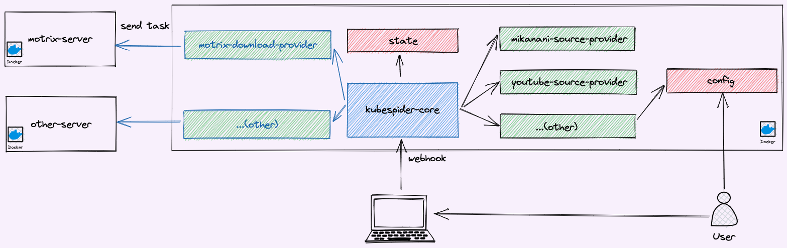
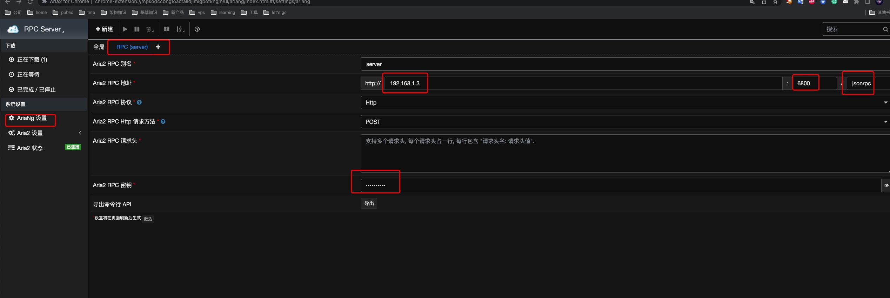
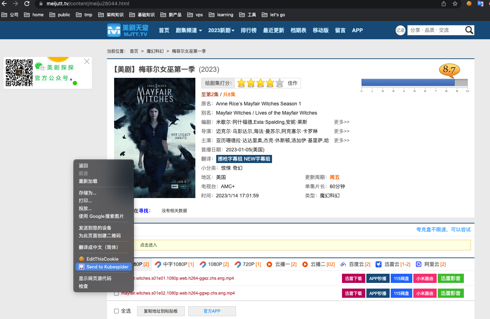
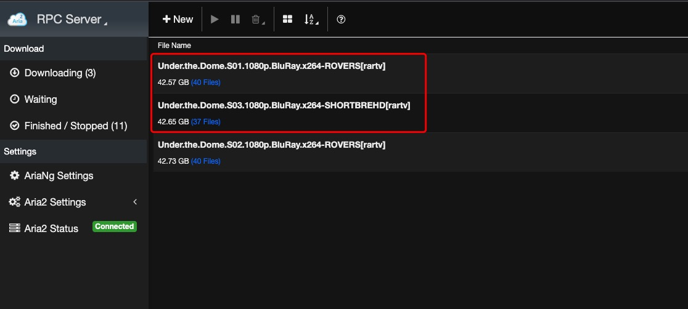

# Kubespider
<p align="center">
  
</p>

## 💥 一款全局资源编排下载系统

[](https://github.com/opennaslab/kubespider/releases)
[](https://hub.docker.com/repository/docker/cesign/kubespider/general)
[](https://github.com/opennaslab/kubespider/stargazers)
[](https://github.com/opennaslab/kubespider/blob/master/LICENSE)

[English](./README.md) | 简体中文  

[安装](#-安装) | [配置](#-特性列表) | [开发者群](https://t.me/+RR09tPuCvI9iNTc1)

我们是一群热爱生活的人，因兴趣和共同需求聚集在一起，利用空闲时间共同开发了 Kubespider。  

开发Kubespider的出发点是：局域网有一台空闲的服务器，想把它作为NAS，实现自动追剧下载，本地笔记本电脑触发下载，同时适配各种网站资源（Youtube、Bilibili等）和资源类型（电视剧、电影、音乐等）。  

之前接触到Terraform，惊讶于其通用性。Kubespider受到Terraform启发，旨在构建一个通用的下载编排系统，兼容各种资源平台和下载软件，兼容多种下载方式（请求触发，周期触发，更新触发），做资源下载最完美的统一解决方案。

## ⛵ 系统架构
为了实现一个通用的下载编排系统，需要适配各种资源网站和下载软件，所以将这两部分从核心功能中抽象出来：

* `kubespider-core`：Kubespider核心模块，接受触发下载请求，调用资源提供器provider解析（最终会解析为标准模式，如用户输入bilibili博主地址，对应资源提供器输出mp4文件地址下载列表），最后调用下载提供器provider实现下载；此模块同时也会周期调用providers(如追剧provider)，下载增加的资源。
* `source-provider`：各资源网站的提供器，接受通用资源地址输入，输出为标准资源地址url，如输入为某个bilibili博主的个人主页，输出为博主视频的所有mp4下载地址。配置文件在`.config/source_provider.yaml`。
* `download-provider`：各下载软件的提供器，接收`kubespider-core`的请求Task，调用对应的服务实现下载。配置文件在`.config/download_provider.yaml`。

## 💽 安装

Kubespider为了适配多种资源平台，提供了许多适配器，按你的需要开启或关闭这些适配器，配置文件在`.config`文件夹。

### 前提

1. 操作电脑和你的服务器在同一局域网。（暂时还没有试过不在同一局域网的安装）
2. 服务器为linux系统。
3. 服务器已安装Docker。

### 默认安装（使用Docker部署）

使用本项目预设脚本安装，可以自动化下载并配置所需项目。

#### 1.下载代码库并且安装

```sh
# 定义如下环境变量指定安装路径
# export KUBESPIDER_HOME=xxx
# 如果镜像无法下载或速度较慢请设置此环境变量
# export CHINA_MAINLAND=TRUE
git clone https://github.com/opennaslab/kubespider.git
cd kubespider
bash hack/install_kubespider.sh
```
输出类似：
```sh
root@cesign [09:01:34 PM] [+22.0°C] [~/git/kubespider] [main *]
-> # bash hack/install_kubespider.sh
 _          _                     _     _
| | ___   _| |__   ___  ___ _ __ (_) __| | ___ _ __
| |/ / | | | '_ \ / _ \/ __| '_ \| |/ _` |/ _ \ '__|
|   <| |_| | |_) |  __/\__ \ |_) | | (_| |  __/ |
|_|\_\\__,_|_.__/ \___||___/ .__/|_|\__,_|\___|_|
                           |_|
[INFO] Start to deploy with default configuration...
b13820946878c4f00635e7fa3db64ea83506850ebb7d07ff77b62814db1d894a
WARNING: Published ports are discarded when using host network mode
9c0aa1059f1546a4f1a2accac445ce1389f1c400b96328f3e18c8af03f0bbc70
[INFO] Deploy successful, check the information:
*******************************************
Kubespider config path: /root/kubespider/.config
Download file path: /root/kubespider/nas/
Kubespider webhook address: http://<server_ip>:3080
Aria2 server address: http://<server_ip>:6800/jsonrpc, you can use any gui or webui to connect it
Aria2 default secret is:kubespider
*******************************************
```
* 此步骤会安装`Kubespide`和`Aria2`资源下载程序，作为默认的下载器。
* 安装后，默认**所有下载文件会存储到 `${HOME}/kubespider/nas`**。
* 配置文件默认在 `${HOME}/kubespider/.config`。

#### 2.连接aria2
为了便于查看下载任务，需要下载Chrome插件AriNg:(1)如果你能访问外网，在chrome商店下载[AriaNg](https://chrome.google.com/webstore/detail/aria2-for-chrome/mpkodccbngfoacfalldjimigbofkhgjn)；(2)如果不能，在Crx4Chrome下载[AriaNg](https://www.crx4chrome.com/crx/85196/)。  

然后连接，插件配置如下(显示在脚本`install_kubespider.sh`执行输出最后)：


当然，非必需的，你也可以使用桌面程序连接：[AriaNg](https://github.com/mayswind/AriaNg-Native/releases/)

#### 3.安装Chrome插件
Kubespider结合chrome插件，能获得更好的体验。  
在步骤1下载代码后，打开Chrome，按如下步骤安装Kubespider Chrome插件并且设置(其中地址为`http://<server_ip>:3080`)：
  

如我要追剧，直接右键，发送给Kubespider即可([示例网站](https://www.meijutt.tv/))：


Kubesdpier会自动下载现有的所有剧集并且追更：


#### 4.更多（可选）
* 安装Plex，多平台观看视频，[立即安装](./docs/zh/user_guide/plex_install_config/README.md)。
* 安装Jellyfin，多平台观看视频，[立即安装](./docs/zh/user_guide/jellyfin_install_config/README.md)。
* 安装百度网盘，后台下载，[立即安装](TODO)。

### 其他安装方式

* 使用docker-cli或者docker-compose部署，请参考 [link](./docs/zh/user_guide/install_with_command/README.md)。
* 在群辉上安装Kubespider，请参考 [link](./docs/zh/user_guide/synology_installation/README.md)。
* 在铁威马上安装Kubespider，请参考 [link](./docs/zh/user_guide/terramaster_installation/README.md)。
* 在asustor上安装Kubespider，请参考 [link](./docs/zh/user_guide/asustor_installation/README.md)。

## 📝 配置
全局配置文件在`.config/kubespider.yaml`，安装后默认位于`${HOME}/kubespider/.config/kubespider.yaml`，各配置项解释如下：  
|  配置项  | 是否必配 |                   功能 |
| :-------- | -----: | -------------------: |
| `proxy` |      否 | 请求代理，如`http://192.168.1.5:1087` |
| `auth_token` | 否 | 认证token，用于下载触发请求认证，如果需要公网访问可以配置，以增加安全性 |
| `auto_change_download_provider` | 否 | 控制是否为失败和长时阻塞任务切换下载提供器 |
| `server_port` | 否 | 提供API服务的端口 |

## 🔧 特性列表
### 资源提供器(按需配置)
如前面所述，资源提供器用于对接各种资源网站，条件触发下载相关资源：
| 资源提供器 | 是否支持 | 用途 | 配置手册 |
| :-------- | -----: | ---: | ------: |
| mikanani资源提供器  | 是     | 全自动动漫追番 | [link](./docs/zh/user_guide/mikanani_source_provider/README.md) |
| btbtt12资源提供器 | 是 | 实现链接触发下载，简化下载流程 | [link](./docs/zh/user_guide/btbtt12_disposable_source_provider/README.md) |
| meijutt资源提供器 | 是 | 自动追美剧 | [link](./docs/zh/user_guide/meijutt_source_provider/README.md) |
| YouTube资源提供器 | 是 | 触发下载YouTube视频 | [link](./docs/zh/user_guide/youtube_source_provider/README.md) |
| Bilibili资源提供器 | 是 | 触发下载Bilibili视频 | [link](./docs/zh/user_guide/bilibili_source_provider/README.md) |
| 通用rss资源提供器 | 是 | 自动下载rss订阅资源 | [link](./docs/zh/user_guide/general_rss_source_provider/README.md) |
| 魔法资源提供器 | 是 | 触发下载通过xpath配置的内容资源 | [link](./docs/zh/user_guide/magic_source_provider/README.md) |
| 抖音资源提供器 | 是 | 触发下载带水印的抖音视频 | [link](./docs/zh/user_guide/tiktok_source_provider/README.md) |

### 下载提供器(按需配置)
为了充分利用开源社区已有的下载软件(如YouTube有专门的下载软件)，目前支持如下下载软件：
| 下载软件 | 是否支持 | 配置手册 |
| :---- | ------: | -----: |
| aria2 |    是   | [link](./docs/zh/user_guide/aria2_download_provider/README.md) |
| 迅雷   |   是    | [link](./docs/zh/user_guide/thunder_install_config/README.md) |
| qBittorrent | 是| [link](./docs/zh/user_guide/qbittorrent_download_provider/README.md) |
| you-get  | 是     | [link](./docs/zh/user_guide/youget_download_provider/README.md)      |
| yt-dlp   | 是   | [link](./docs/zh/user_guide/ytdlp_download_provider/README.md) |
| transmission | 是   | [link](./docs/zh/user_guide/transmission_download_provider/README.md) |

### 基本特性
目前支持如下文件触发下载：
| 下载类型 | 是否支持 |
| :-----  | ------: |
| magnet  |   是    |
| torrent |   是    |
| 通用文件(jpg, mp4等) |   是    |

触发下载使用方法请查看 [link](./docs/zh/user_guide/trigger_download/README.md)。

## 🙋 常见问题

我们列举了使用过程中[可能遇到的问题](docs/zh/faq.md)供您参考，也欢迎您记录您的问题和解决方案，共同完善文档。

## 🤝 参与共建 [](http://makeapullrequest.com)

如果你有兴趣参与共同开发，欢迎 STAR/FORK/PR，Roadmap请查看 [link](./docs/zh/roadmap.md)。
* 如何开发调试Kubespider，请看 [link](./CONTRIBUTING-CN.md)。
* 如何编写资源网站的资源提供器，请看 [link](./docs/zh/contribute/implement_source_provider_cn.md)。
* 如何编写下载软件的下载提供器，请看 [link](./docs/zh/contribute/implement_download_provider_cn.md)。
* 如何开发调试chrome插件webhook，请看 [link](./docs/zh/contribute/develop_chrome_extension.md)。
* 如何开发其他webhook触发工具, 请看 [link](./docs/zh/user_guide/api_docs/README.md)。

如果你想更多的参与社区，欢迎加入我们的 [Telegram开发者群](https://t.me/+RR09tPuCvI9iNTc1).

## ❤️ 赞助  
感谢以下公司赞助开发工具，排名不分先后：
<table style="background-color: white">
  <thead>
    <tr>
      <th align="center" style="height: 80px;">
        <a href="https://www.jetbrains.com/">
          <br>
        </a>
      </th>
      <th align="center" style="height: 80px;">
        <a href="https://www.synology.cn/">
          <br>
        </a>
      </th>
      <th align="center" style="height: 80px;">
        <a href="https://www.terra-master.com/">
          <br>
        </a>
      </th>
      <th align="center" style="height: 80px;">
        <a href="https://www.qnap.com.cn/">
          <br>
        </a>
      </th>
      <th align="center" style="height: 80px;">
        <a href="https://www.asustor.com/zh-cn/">
          <br>
        </a>
      </th>
    </tr>
  </thead>
</table>

## 📃 免责声明
一切下载及使用软件时均被视为已经仔细阅读并完全同意以下条款：
* 软件仅供个人学习与交流使用，严禁用于商业以及不良用途。
* 如有发现任何商业行为以及不良用途，软件作者有权撤销使用权。
* 使用本软件所存在的风险将完全由其本人承担，软件作者不承担任何责任。
* 软件注明之服务条款外，其它因不当使用本软件而导致的任何意外、疏忽、合约毁坏、诽谤、版权或其他知识产权侵犯及其所造成的任何损失，本软件作者概不负责，亦不承担任何法律责任。
* 对于因不可抗力或因黑客攻击、通讯线路中断等不能控制的原因造成的服务中断或其他缺陷，导致用户不能正常使用，软件作者不承担任何责任，但将尽力减少因此给用户造成的损失或影响。
* 本声明未涉及的问题请参见国家有关法律法规，当本声明与国家有关法律法规冲突时，以国家法律法规为准。
* 本软件相关声明版权及其修改权、更新权和最终解释权均属软件作者所有。