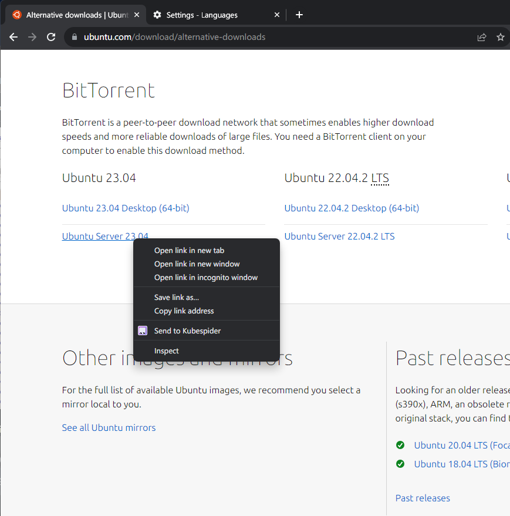

# Kubespider

  
[LOGO准备中...]

## 💥 一款全局资源编排下载系统
[](https://github.com/agalwood/Motrix/releases)   

[English](./README.md) | 简体中文  
我是一个云计算工程师🤓，专注Serverles/FinOps/Runtime，利用空闲之余开发了 Kubespider。
开发Kubespider的出发点是：我有一台空闲的服务器（局域网），想把它作为NAS，实现自动追剧下载，本地笔记本电脑触发下载，同时适配各种网站资源（Youtube、Bilibili等)。

之前接触到Terraform，惊讶于其通用性。Kubespider受到Terraform启发，旨在构建一个通用的下载编排系统，兼容各种资源平台和下载软件，兼容多种下载方式（请求触发，周期触发，更新触发），做资源下载最完美的统一解决方案。

## ⛵ 系统架构
为了实现一个通用的下载编排系统，需要适配各种资源网站和下载软件，所以将这两部分从核心功能中抽象出来：

* `kubespider-core`：Kubespider核心模块，接受触发下载请求，调用资源提供器provider解析（最终会解析为标准模式，如用户输入bilibili博主地址，对应资源提供器输出mp4文件地址下载列表），最后调用下载提供器provider实现下载；此模块同时也会周期调用providers(如追剧provider)，下载增加的资源。
* `source-provider`：各资源网站的提供器，接受通用资源地址输入，输出为标准资源地址url，如输入为某个bilibili博主的个人主页，输出为博主视频的所有mp4下载地址。配置文件在`./kubespider/source_provider.cfg`。
* `download-provider`：各下载软件的提供器，接收`kubespider-core`的请求Task，调用对应的服务实现下载。配置文件在`./kubespider/download_provider.cfg`。

## 💽 安装
### 前提
1. 操作电脑和你的服务器在同一局域网。（暂时还没有试过不在同一局域网的安装）
2. 服务器为linux系统。
3. 服务器已安装Docker。

### 默认安装
Kubespider为了适配多种资源平台，提供了许多适配器，按你的需要开启或关闭这些适配器，配置文件在`.kubespider`文件夹：

#### 1.下载代码库并且安装
```sh
git clone https://github.com/jwcesign/kubespider.git
cd kubespider
bash hack/install.sh
```
输出类似：
```sh
root@cesign [09:01:34 PM] [+22.0°C] [~/git/kubespider] [main *]
-> # bash hack/install.sh
 _          _                     _     _
| | ___   _| |__   ___  ___ _ __ (_) __| | ___ _ __
| |/ / | | | '_ \ / _ \/ __| '_ \| |/ _` |/ _ \ '__|
|   <| |_| | |_) |  __/\__ \ |_) | | (_| |  __/ |
|_|\_\\__,_|_.__/ \___||___/ .__/|_|\__,_|\___|_|
                           |_|
[INFO] Start to deploy with default configuration...
b13820946878c4f00635e7fa3db64ea83506850ebb7d07ff77b62814db1d894a
WARNING: Published ports are discarded when using host network mode
9c0aa1059f1546a4f1a2accac445ce1389f1c400b96328f3e18c8af03f0bbc70
[INFO] Deploy successful, check the information:
*******************************************
Kubespider config path: /root/.kubespider/
Download file path: /root/kubespider/nas/
Kubespider webhook address: http://<server_ip>:3080
Aria2 server address: http://<server_ip>:6800/jsonrpc, you can use any gui or webui to connect it
Aria2 default secret is:kubespider
*******************************************
```
* 此步骤会安装`Kubespide`和`Aria2`资源下载程序，作为默认的下载器。
* 安装后，**所有下载文件会存储到 `/${HOME}/kubespider/nas`**。  
* 配置文件在 `/${HOME}/.kubespider/`。

#### 2.连接aria2 
为了便于查看下载任务，去chrome商店下载[Aria2插件](https://chrome.google.com/webstore/detail/aria2-for-chrome/mpkodccbngfoacfalldjimigbofkhgjn)。  
然后连接，插件配置如下(其中配置在`install.sh`脚本最后已输出)：  


当然，非必需的，你也可以使用桌面程序连接：[AriaNg](https://github.com/mayswind/AriaNg-Native/releases/)

#### 3.安装Chrome插件  
TBD（还未发布）  
Kubespider结合chrome插件，能获得更好的体验，如我要追剧，直接将如下网页地址发送给Kubespider即可：


#### 4.更多（可选）
* 安装Plex，多平台观看视频，[立即安装](./docs/zh/user_guide/plex_install_config/README.md)。
* 安装百度网盘，长时下载，[立即安装](TODO)。
* 安装迅雷，长时下载，[立即安装](TODO)。

## 🔧 特性列表
### 基本特性
* 支持magnent, torrent, 以及普通资源下载，如zip等。

### 下载提供器
* 支持aria2类型的下载器。

### 资源提供器
* 基于mikanani，实现全自动动漫追番，配置请查看 [link](./docs/zh/user_guide/mikanani_source_provider/README.md)。
* 下载btbtt12相关种子资源，配置请查看 [link](./docs/zh/user_guide/btbtt12_disposable_source_provider/README.md)。
* 基于meijutt实现自动追美剧，配置请查看 [link](./docs/zh/user_guide/meijutt_source_provider/README.md)。
* 基于y2mate，实现下载youtube视频（TODO）。

## 🤝 参与共建 [](http://makeapullrequest.com)

如果你有兴趣参与共同开发，欢迎 STAR/FORK/PR，Roadmap请查看 [link](./docs/zh/roadmap.md)。
* 如何编写资源网站的资源提供器，请看 [link](./docs/zh/contribute/implement_source_provider_cn.md)。
* 如何编写下载软件的下载提供器，请看 [link](./docs/zh/contribute/implement_download_provider_cn.md)。
* 如何开发chrome插件webhook，请看 [link](./docs/zh/contribute/develop_chrome_extension.md)。