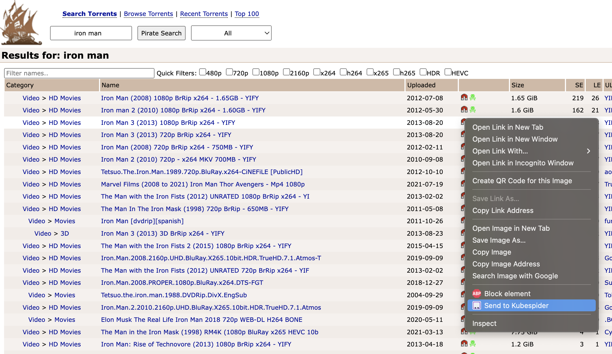

# Kubespider
<p align="center">
  
</p>

## 💥 A global resource download orchestration system

[](https://github.com/opennaslab/kubespider/releases)
[](https://hub.docker.com/repository/docker/cesign/kubespider/general)
[](https://github.com/opennaslab/kubespider/stargazers)
[](https://github.com/opennaslab/kubespider/blob/master/LICENSE)


English | [简体中文](./README-CN.md)  

[Installation](#-installation) | [Configuration](#-feature-list) | [Developer Group](https://t.me/+RR09tPuCvI9iNTc1)

We are a community of individuals who share a passion for life and have come together based on shared interests and needs. In our free time, we collaborated to develop Kubespider.  

Kubespider is developed to utilize an idle server in a local area network as a NAS, enabling automatic downloads of TV series, triggering downloads from a local laptop, and adapting to various websites such as YouTube and BiliBili, as well as different types of resources such as TV series, movies, music and more.  

After being exposed to Terraform and its great versatility, we were inspired to create Kubespider as a general download orchestration system that is compatible with various resource platforms and download software. Kubespider supports multiple download methods, including request trigger, cycle trigger, and update trigger, making it the most comprehensive and unified solution for resource downloads.

## ⛵ System architecture
To realize a general download orchestration system, it is necessary to adapt various resource websites and download software, so these two parts are abstracted from the core functions:

* `kubespider-core`: The core module of Kubespider accepts the trigger download request, calls the resource provider for resolution (it will eventually be resolved into a standard mode, such as the user enters the bilibili blogger address, and the corresponding resource provider outputs the mp4 file address download list), and finally calls the download provider to implement Download; this module will also periodically call providers (such as TV series provider) to download additional resources.
* `source-provider`：The provider of each resource website accepts input of general resource addresses, and outputs standard resource address URLs, such as the personal homepage of a YouTuber, and outputs all mp4 download addresses of the blogger’s videos. The configuration file is in `.config/source_provider.yaml`.
* `download-provider`：The provider of each download software receives the request task from `kubespider-core`, and calls the corresponding service to realize the download. The configuration file is in `.config/download_provider.yaml`.

## 💽 Installation

To adapt to multiple resource platforms, Kubespider provides many adapters. Enable or disable these adapters according to your needs. The configuration file is in the `.config` folder.

### Premise

1. The operating computer and your server are on the same LAN. (I haven't tried the installation not in the same LAN yet)
2. The server is a Linux system。
3. Docker is installed on the server。

### Default installation (with docker)

Installing with built-in command can download and config anything needed automatically.

#### 1.Download the repository and install

```sh
# Define KUBESPIDER_HOME to specify the installation path
# export KUBESPIDER_HOME=xxx
git clone https://github.com/opennaslab/kubespider.git
cd kubespider
bash hack/install_kubespider.sh
```
Output like:
```sh
root@cesign [09:01:34 PM] [+22.0°C] [~/git/kubespider] [main *]
-> # bash hack/install_kubespider.sh
 _          _                     _     _
| | ___   _| |__   ___  ___ _ __ (_) __| | ___ _ __
| |/ / | | | '_ \ / _ \/ __| '_ \| |/ _` |/ _ \ '__|
|   <| |_| | |_) |  __/\__ \ |_) | | (_| |  __/ |
|_|\_\\__,_|_.__/ \___||___/ .__/|_|\__,_|\___|_|
                           |_|
[INFO] Start to deploy with default configuration...
b13820946878c4f00635e7fa3db64ea83506850ebb7d07ff77b62814db1d894a
9c0aa1059f1546a4f1a2accac445ce1389f1c400b96328f3e18c8af03f0bbc70
[INFO] Deploy successful, check the information:
*******************************************
Kubespider config path: /root/kubespider/.config/
Download file path: /root/kubespider/nas/
Kubespider webhook address: http://<server_ip>:3080
Aria2 server address: http://<server_ip>:6800/jsonrpc, you can use any gui or webui to connect it
Aria2 default secret is:kubespider
*******************************************
```
* This step will install `Kubespide` and `Aria2` resource downloader as the default downloader.
* After installation, **all downloaded files will be stored in `${HOME}/kubespider/nas`** by default.
* Configuration files are located in `${HOME}/kubespider/.config` by default.

#### 2.Connect to aria2
For checking the download tasks on your server conveniently, go to the chrome store to download [AriaNg plugin](https://chrome.google.com/webstore/detail/aria2-for-chrome/mpkodccbngfoacfalldjimigbofkhgjn).  
Then connect, the plugin configuration is as follows(shown at the end of the script `install_kubespider.sh` execution output):


Of course, it is not necessary, you can also use the desktop program to connect: [AriaNg](https://github.com/mayswind/AriaNg-Native/releases/)

#### 3.Install Chrome plugin
With Kubespider Chrome plugin, you can get a better experience.  
After step 1 has been done, open chrome, then install Kubespider plugin, and configure it as follows(The server address is `http://<server_ip>:3080`):
  

If I want to download a movie, I can right click and send the download task to Kubespider([demo website](https://thepiratebay.org/)):


Then with aria2 chrome plugin, you can see the download task starts:


#### 4.More (Optional)
* Install Plex, watch videos on multiple platforms, [install now](./docs/zh/user_guide/plex_install_config/README.md).
* Install Jellyfin, watch videos on multiple platforms, [install now](./docs/zh/user_guide/jellyfin_install_config/README.md).
* Install Baidu network disk(only in china), download in the background, [install now](TODO).

### Other installation

* Install with docker-cli/docker-compose command mannually, see [link](./docs/en/user_guide/install_with_command/README.md).
* Install Kubespider on Synology, see [link](./docs/zh/user_guide/synology_installation/README.md).
* Install Kubespider on TerraMaster, see [link](./docs/zh/user_guide/terramaster_installation/README.md).
* Install Kubespider on Asustor, see [link](./docs/zh/user_guide/asustor_installation/README.md).

## 📝 Configuration
The global configuration file is located at `.config/kubespider.yaml`, which is installed under `${HOME}/kubespider/.config/kubespider.yaml` by default. The description of each configuration item is as follows:

|  Configuration Item  | Required |                   Function |
| :-------- | -----: | -------------------: |
| `proxy` |      No | The request proxy, such as `http://192.168.1.5:1087` |
| `auth_token`| No | Authentication token, used for authentication when triggering download requests. If public network access is required, it can be configured to increase security. |
| `auto_change_download_provider` | No | Swith to control whether to change download provoider for failed/long-time-pending download tasks automatically. |
| `server_port` | No | The port used to provider API service |

## 🔧 Feature list
### Source provider(Configured as needed)  
As mentioned before, the source provider is used to adapt to different websites, and download related resources based on the conditions:
| Source Provider | Support | Purpose | Configuration |
| :-------- | -----: | ---: | ------: |
| mikanani source provider  | Yes     | Automatically download updated anime | [link](./docs/zh/user_guide/mikanani_source_provider/README.md) |
| btbtt12 source provider | Yes | Trigger download resource in btbtt12 website | [link](./docs/zh/user_guide/btbtt12_disposable_source_provider/README.md) |
| meijutt source provider | Yes | Download updated TV series | [link](./docs/zh/user_guide/meijutt_source_provider/README.md) |
| YouTube source provider | Yes | Trigger download YouTube video | [link](./docs/zh/user_guide/youtube_source_provider/README.md) |
| Bilibili source provider | Yes | Trigger download bilibili video | [link](./docs/zh/user_guide/bilibili_source_provider/README.md) |
| general rss source provider | Yes | Automatically download rss source | [link](./docs/zh/user_guide/general_rss_source_provider/README.md) |
| Magic source provider | Yes | Trigger download resource via xpath configuration | [link](./docs/zh/user_guide/magic_source_provider/README.md) |
| Douyin source provider | Yes | Trigger download Douyin video with watermark | [link](./docs/zh/user_guide/tiktok_source_provider/README.md) |

### Download provider(Configured as needed)  
In order to make full use of the existing download software in the open-source community(For example, YouTube has dedicated download software), the following software is currently supported:
| Download Software | Support | Configuration |
| :---------------- | ------: | ------------: |
| aria2             | Yes     | [link](./docs/zh/user_guide/aria2_download_provider/README.md) |
| xunlei            | Yes     | [link](./docs/zh/user_guide/thunder_install_config/README.md) |
| qBittorrent       | Yes     | [link](./docs/zh/user_guide/qbittorrent_download_provider/README.md) | 
| you-get           | Yes     | [link](./docs/zh/user_guide/youget_download_provider/README.md)    |
| yt-dlp            | Yes     | [link](./docs/zh/user_guide/ytdlp_download_provider/README.md) |
| transmission      | Yes     | [link](./docs/zh/user_guide/transmission_download_provider/README.md) |


### Basic feature  
Currently, the following file types are supported to trigger downloading:
| Download Types | Support |
| :------------- | ------: |
| magnet         | Yes     | 
| torrent        | Yes     |
| general(jpg, mp4, etc.) | Yes |

Please refer to [link](./docs/zh/user_guide/trigger_download/README.md) for how to trigger the download.

## 🙋 FAQ
See the [FAQ](docs/en/faq.md) for more details, and feel free to contribute your questions and solutions. Your valuable input will collectively improve the documentation and benefit a wider audience. Join us in making a difference!

## 🤝 Contribution [](http://makeapullrequest.com)

If you are interested in participating in joint development, welcome to STAR/FORK/PR, please check [link](./docs/zh/roadmap.md) for Roadmap.
* For how to develop/debug Kubespider, please see [link](./CONTRIBUTING.md).
* For how to implement a resource provider for a resource website, please see [link](./docs/zh/contribute/implement_source_provider_cn.md).
* For how to implement a download provider for download software, please see [link](./docs/en/contribute/implement_download_provider_cn.md).
* For how to develop chrome extension webhook, please see [link](./docs/zh/contribute/develop_chrome_extension.md).
* For how to implement other webhook trigger tools, please see [link](./docs/zh/user_guide/api_docs/README.md).

If you want to participate more in the community, welcome to join our [Telegram developer group](https://t.me/+RR09tPuCvI9iNTc1).


## ❤️ Sponsor  
Thanks to the following companies for sponsoring development tools, the ranking is not in any particular order:
<table style="background-color: white">
  <thead>
    <tr>
      <th align="center" style="height: 80px;">
        <a href="https://www.jetbrains.com/">
          <br>
        </a>
      </th>
      <th align="center" style="height: 80px;">
        <a href="https://www.synology.cn/">
          <br>
        </a>
      </th>
      <th align="center" style="height: 80px;">
        <a href="https://www.terra-master.com/">
          <br>
        </a>
      </th>
      <th align="center" style="height: 80px;">
        <a href="https://www.qnap.com.cn/">
          <br>
        </a>
      </th>
      <th align="center" style="height: 80px;">
        <a href="https://www.asustor.com/">
          <br>
        </a>
      </th>
    </tr>
  </thead>
</table>

## 📃 Disclaimer
All downloading and use of the software are deemed to have carefully read and fully agreed to the following terms:
* The software is only for personal learning and communication, and it is strictly prohibited for commercial and bad purposes.
* If any commercial behavior and bad use are found, the software author has the right to revoke the right to use.
* The risk of using this software will be entirely borne by him, and the software author will not bear any responsibility.
* Except for the terms of service indicated in the software, the author of this software is not responsible for any accidents, negligence, contract damage, defamation, copyright or other intellectual property infringement and any losses caused by improper use of this software, and also no legal responsibility is assumed.
* The author of the software will not be responsible for the interruption of services or other defects caused by force majeure or uncontrollable reasons such as hacker attacks, communication line interruptions, etc., which cause users to fail to use normally but will try their best to reduce losses or impacts caused to users.
* For issues not covered in this statement, please refer to relevant national laws and regulations. When this statement conflicts with relevant national laws and regulations, the national laws and regulations shall prevail.
* The copyright of this software statement and its right to modify, update and final interpretation belong to the software author.