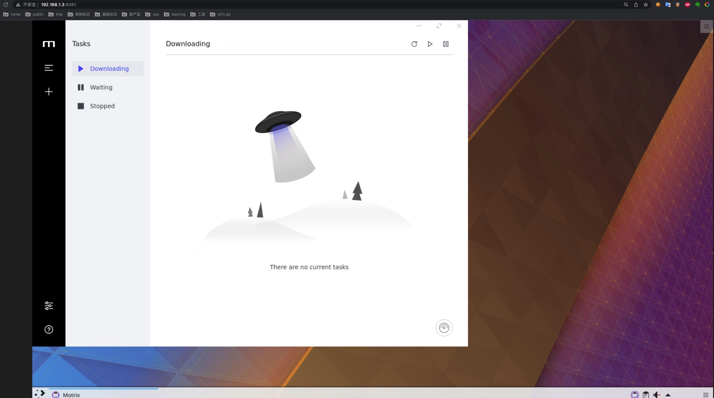

# Deploy with Docker

## Before Start
I strongly recommend you deploy kubespider with docker, it's easy and fast.
So you should install docker on your machine(personal-server or nas). Follow [official docs](https://docs.docker.com/engine/install/ubuntu/) to install it if you not.


## Run Download Server
1. Creat download directory
    ```sh
    mkdir ~/netdisk/motrix/
    mkdir ~/nas/
    ```
2. Run your download server
    Now we only support motrix, if you have interests to implement other, don't mind to give a PR.
    ```sh
    docker run -itd --name motrix  \
        -p 8081:8080  \
        -p 5901:5900 \
        -p 16800:16800 \
        -v /~/netdisk/motrix/:/config  \
        -v /~/nas/:/config/Downloads \
        msjpq/motrix-vnc
    ```

3. Start the motrix programe
    Open your chrome(or other browser), and go to `http://<your_personal-server/nas_ip>:8081` and start motrix as follows:
    


## Config Kubespider
1. Set config file
   Kubespider provider general file download, like torrent, zip, exe and etc.
   If you want to use other advanced features, configure as following:
    ```sh
    mkdir -p ""
    ```

## Run Kubespider