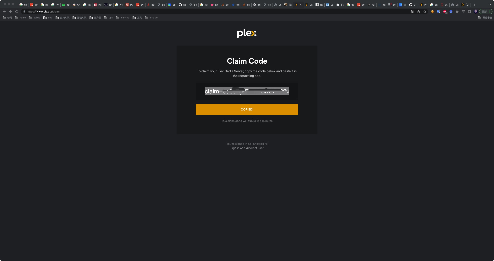
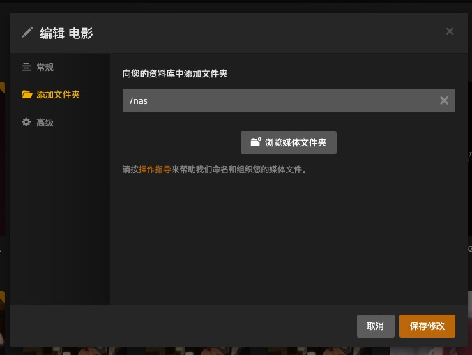

# Deploy Plex to enjoy better

## Before start
Once you deploy Plex, you can check the vide better, looks like:


## Get your plex claim
Go to [Plex Claim](https://www.plex.tv/claim/) to get your claim:


## Deploy Plex with Docker
Go to the repo root dir and run:
```sh
export PLEX_CLAIM=<what u get from before steps>
bash hack/install_plex.sh
```

The output will be like:
```sh
root@cesign [02:30:23 PM] [+31.0°C] [~/git/kubespider] [main *]
-> # bash hack/install_plex.sh
 _          _                     _     _
| | ___   _| |__   ___  ___ _ __ (_) __| | ___ _ __
| |/ / | | | '_ \ / _ \/ __| '_ \| |/ _` |/ _ \ '__|
|   <| |_| | |_) |  __/\__ \ |_) | | (_| |  __/ |
|_|\_\\__,_|_.__/ \___||___/ .__/|_|\__,_|\___|_|
                           |_|
[INFO] Start to deploy plex ...
a1110a5eda97d5062d7435bccd1cc90fe85df950e9519075c770f6e99471fe1d
[INFO] Deploy flex success, enjoy your time...
[INFO] Plex UI address is: http://<your_server_ip>:32400
```

## Config Plex
Go to `http://<your_server_ip>:32400` and add `/nas` as the movie dir:


**Enjoy your time!!!**