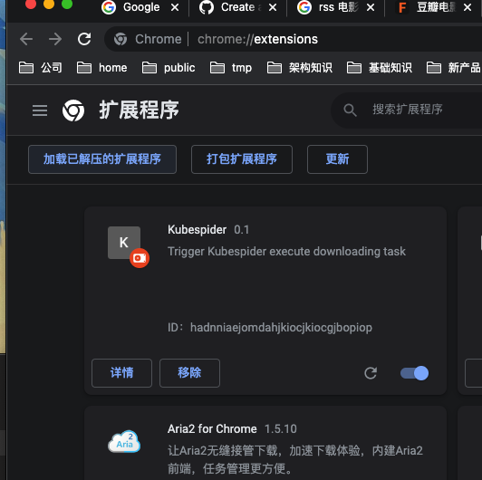
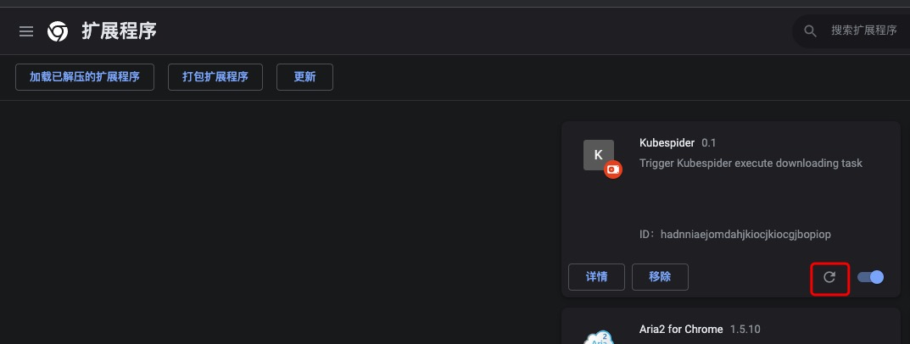

# Chrome插件开发

## 开始之前
为什么我们需要kubespider的插件呢？大部分资源内容，我们都是在游览器中找到的，为了减少操作步骤，方便用户下载，这是开发此插件的初衷。结合Kubespider的编排下载，能极大提升下载体验。在整个系统架构中，Chrome插件作为一种webhook触发工具存在。  
Chrome插件都是html+css+js的组合，和前端开发几乎一致。只需要了解少许的Chrome特定接口，即可完成开发。

## 开发流程
### 1.导入Chrome插件
在Chrome中点击如下按钮，选择管理扩展程序：  
  

然后点击点击开启开发者模式：  
  

然后点击加载已解压的扩展程序：  
  
  
到下载库下的chrome-extension文件夹，选择导入即可：  
  
最后点击确定。

### 2.测试插件
点击插件，测试即可：  
  

如果有修改，在管理程序页面重新载入插件即可：  
  

### 3.提交PR代码
测试结束后，提交代码即可。