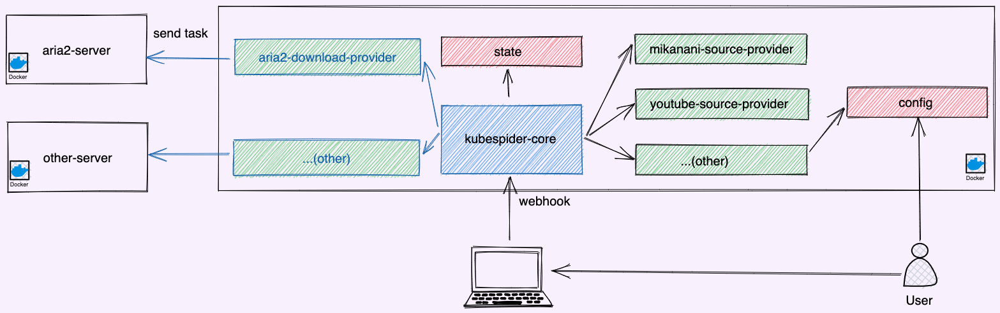

# Kubespider寻求合作

Kubespider自2022年11月开源以来，得到了众多开发者和用户的关注与支持，Star数平稳增长，现已累计贡献者7位，长期维护者4位，BUG响应，新特性迭代都较为迅速，有望成为最受欢迎的NAS资源下载系统之一。  

## 需求
开发一个软件，首先要明白需求是什么，那作为NAS用户，或多或少都有如下需求：
#### 资源需求
1. 自动追剧或者追动漫，自动下载，自己下班回家后就能享受高清资源。
1. 我有一个大文件想下载，想把这个下载过程放到NAS上执行，减少我电脑的资源占用。
1. 我想下载自动下载B站/YouTube视频，方便后续学习使用，希望NAS能处理这部分工作。
2. 作为PT玩家，我希望NAS能自动处理，达到不同PT站的考核要求。
3. 查看豆瓣电影列表，自动下载评分高于8的电影，供学习参考。
4. 各种千奇百怪的资源网站（电影，音乐，图片，文档等），希望NAS都能处理这些网站上面的资源下载，供学习参考。

#### 下载触发需求
1. 触发下载要够快捷，比如鼠标右键就触发下载，手机上点点等。
1. 下载条件要多样性，比如资源更新下载，主动触发下载，自定义条件下载。

**总的来说，就是基于NAS，构建一个系统，给用户提供更便携的完美下载体验！**

## 软件设计
在开源社区，有许许多多针对不同网站的下载软件，同时资源网站也多种多样，Kubespider要做的就是把这两部分联合起来，提供给用户统一、便携、自动化的下载体验，架构下图所示：

* `kubespider-core`：Kubespider核心模块，开放统一的资源下载API，可对接APP或者Chrome插件，触发资源下载，也会周期调用各`source-provider`以下载更新的资源。
* `source-provider`：各资源网站的提供器，适配各种资源网站解析，如B站和YouTube。
* `download-provider`：各下载软件的提供器，适配各种下载软件，如迅雷和Transmission。

对于`source-provider`和`download-provider`，开发者可以按照标准实现接口，即能下载不同网站的资源，可以在其中添加各种下载条件，定制属于你自己的下载场景，如豆瓣评分大与8。

**这样的架构，便于开发者快速、便捷的将任何网站接入Kubespdier。**

## 实际效果
最后的实际效果，用户安装配置好后，在对应资源网站，鼠标右键即可触发下载：

也可以自动下载更新的资源，如自动下载周更的动漫：

## 后续计划
* 支持消息推送。
* 适配更多的受欢迎的网站。
* 吸引更多的中国开发者。
* 吸引国外开发者。

## 合作益处
对贵司来说，有如下益处：
1. 适配贵司的NAS生态，加入一个强有力的资源下载系统。
1. 提升贵司在开发者/用户中的知名度。
1. 后续特性优先适配贵司机型。

对此项目来说，适配贵司机型，也能给我带来更多开发者，一起为爱发电，构建更好的下载系统。
