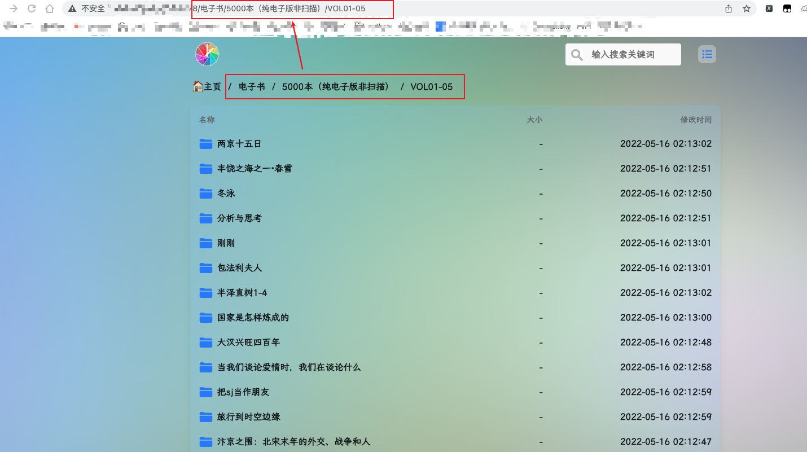
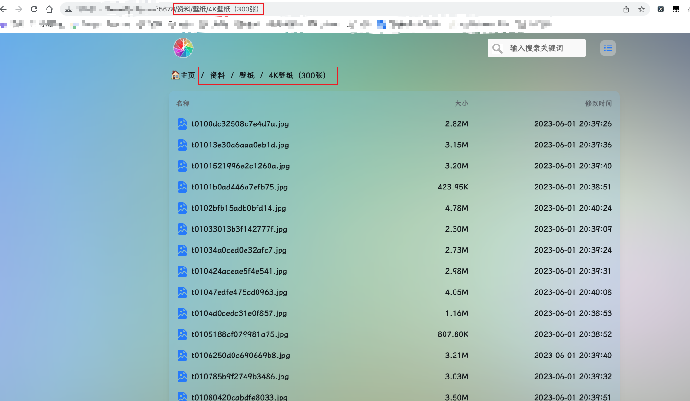

# alist 资源提供器配置

## 简介

该资源提供器可以对指定的alist目录进行监控,当被监控的目录有新增文件或有文件变更时会自动下载。

## 配置

### 1.前提

你已经安装好了Kubespider, 你已经有了alist并成功对接网盘

### 2.配置手册

你可以通过`${HOME}/kubespider/.config/source_provider.yaml`配置，示例如下：

```yaml
alist_source_provider:
  enable: false
  type: alist_source_provider
  host: http://xxx.com:5678/
  watch_dirs:
    - /电子书/5000本（纯电子版非扫描）/VOL01-05/
    - /资料/壁纸/4K壁纸（300张）
```

* `enable`：是否开启此provider
* `type`：订阅源类型，需为`alist_source_provider`
* `host`: alist的host,如有端口,需带上端口
* `watch_dirs`: 需要监听的文件夹,支持多文件夹

## 友情提示

### 1.如何配置 watch_dirs




把获取到的路径填入 watch_dirs 即可

### 2.如何下载

kubespider会自行对配置的文件夹进行监控下载,任务调度的间隔为1小时

建议开启消息通知,下载的信息会自行推送
