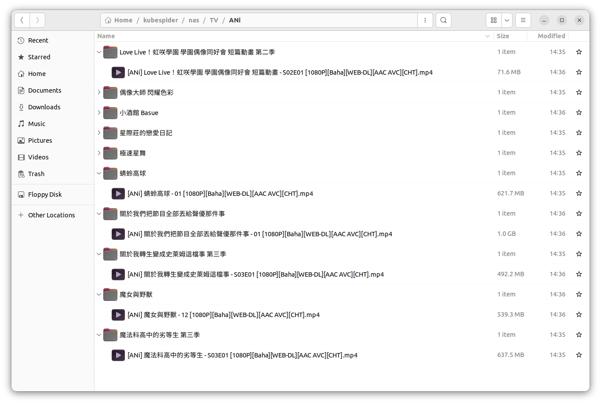
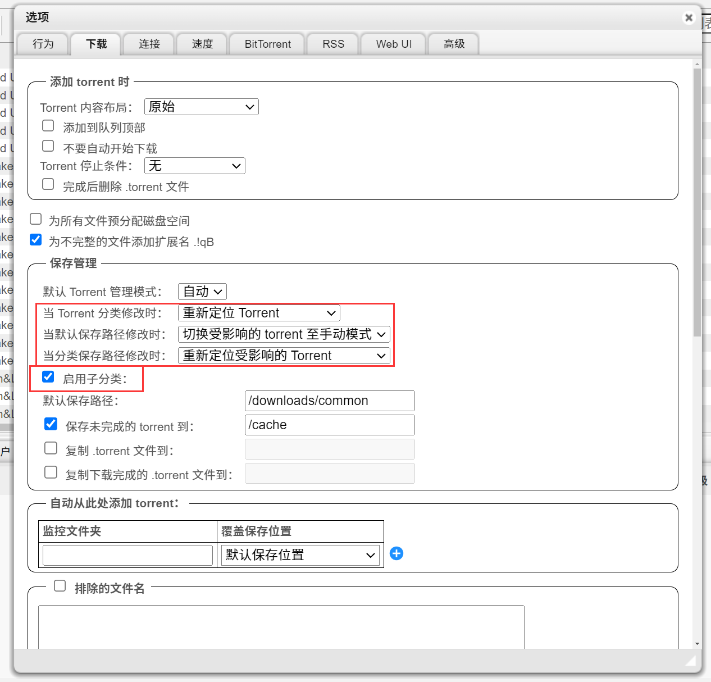
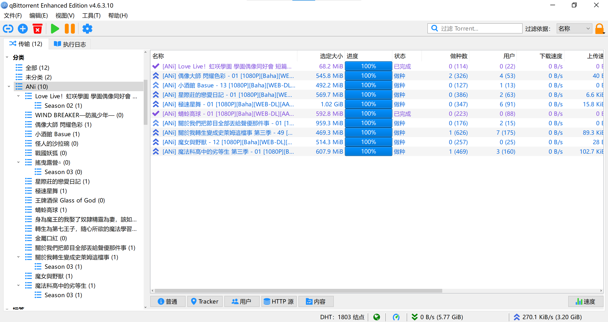

# ANi资源提供器配置
## 简介
ANi Project是一个全自动下载流媒体网站（[动画疯](https://ani.gamer.com.tw/)、[Bilibili](https://www.bilibili.com/anime/)等）番剧资源的项目。官方频道：[Telegram Channel](https://t.me/channel_ani)

由于ANi项目与上游的流媒体平台放送时间完全同步，所以该源能够**最及时**地跟踪正在放送的番剧更新。

本项目将会同步ANi更新的所有番剧到你的私有库中。由于是内嵌字幕，该项目的视频源不适合用作收藏，我们推荐定期清除旧的下载。

同时支持ANi的直链下载API以及Torrent API。

## 前提
你已经安装好了Kubespider。

如果使用Torrent API，我们强烈推荐在`download_provider.yaml`中设定qBittorrent的优先级高于Aria2，以使用qBittorrent的相关新特性。

## 特性

- 自动解析番剧名，识别Season和Episode，并保存为Jellyfin / Emby可直接刮削的文件名格式
- [仅限Torrent API]支持qBittorrent的子分类特性，更好地管理剧集结构
- 支持手动映射Season，以识别类似“石之海篇”、“不灭钻石篇”等非常规Season名，默认识别关键词`第*季`
- [仅限直链API] 支持对集数进行修正，以应对Ani源与TMDB等海外媒体库集号不一致的情况

## 配置手册

你可以通过`${HOME}/kubespider/.config/source_provider.yaml`配置，配置解释如下：

```yaml
ani_source_provider:
  type: ani_source_provider
  enable: false
  api_type: http
  rss_link: https://api.ani.rip/ani-download.xml
  rss_link_torrent: https://api.ani.rip/ani-torrent.xml
  blacklist: [ ]
  # HTTP Options
  classification_on_directory: true
  custom_season_mapping:
  season_episode_adjustment:
  # Torrent Options
  download_param:
    tags:
      - ANi
    category: ANi
  use_sub_category: true
  custom_category_mapping:
```

* `type`：订阅源类型，需为`ani_source_provider`。
* `enable`：是否开启此provider。
* `api_type`：选择使用的API类型，`http`使用直链下载，`torrent`使用种子，默认为`http`。
* `rss_link`：ANi的API地址，默认已经填好。
* `rss_link_torrent`：ANi的Torrent API地址，默认已经填好。
* `classification_on_directory`：是否按照番剧名分文件夹保存。启用该项有助于Emby/Jellyfin等媒体服务器刮削。
* `blacklist`：黑名单，可以是`list`或者`str`，在黑名单中的番剧将不会被下载。黑名单使用纯字符串匹配，**不支持正则表达式**，为空时默认下载所有番剧。
* `custom_season_mapping`：季映射，通过关键字识别映射Season，格式请参考`source_provier.yaml`中的注释或者下方的最佳实践。
* `season_episode_adjustment`：集数修正，格式请参考`source_provier.yaml`中的注释或者下方的最佳实践。
* `download_param.tags`：提交给qBittorrent的tags。
* `download_param.category`：提交给qBittorrent的分类。
* `use_sub_category`：qBittorrent的子分类支持，有助于高效管理番剧内容。
* `custom_category_mapping`：qBittorrent的子分类映射，用于适配用户自己的内容管理模式。

下载好的文件默认保存在`$download_base_path/TV/ANi`中，可根据该路径合理映射docker volume。

## 最佳实践

### 直链API

```yaml
ani_source_provider:
  type: ani_source_provider
  enable: true
  api_type: http
  rss_link: https://api.ani.rip/ani-download.xml
  rss_link_torrent: https://api.ani.rip/ani-torrent.xml
  blacklist:
    - 我的英雄學院
    - 16bit 的感動 ANOTHER LAYER
    - 我們的雨色協議
  # HTTP Options
  classification_on_directory: true
  custom_season_mapping:
    千年血戰篇-訣別譚-: 2
    刀匠村篇: 4
  season_episode_adjustment:
    關於我轉生變成史萊姆這檔事:
      2: -24
      3: -48
    咒术回战:
      2: -24
```

对于直链API，我们的建议是开启`classification_on_directory`。

ANi下载器默认内置了Season识别并且始终启用，遇到常规的“第二季”、“第五季”等关键词，会自动将文件名转换成SXXEXX的格式。

#### custom_season_mapping

`custom_season_mapping`按照`[str] keyword: [int] season`格式填写，在下载剧集时，假设有以下默认保存路径：

```
ANi/BLEACH 死神 千年血战篇-诀别谭-/[ANi] BLEACH 死神 千年血战篇-诀别谭- - 18 [1080P][Baha][WEB-DL][AAC AVC][CHT].mp4
```

经过自定义季映射后，会保存为：

```
ANi/BLEACH 死神 千年血战篇-诀别谭-/[ANi] BLEACH 死神 - S02E18 [1080P][Baha][WEB-DL][AAC AVC][CHT].mp4
```

文件子目录不会变，因为Jellyfin / Emby支持不同Season的TV分开存放在不同目录下，会自动合并。

`custom_season_mapping`会自动剔除文件名中的关键词，然后在集数前加上对应的Season。

#### season_episode_adjustment

ANi部分番剧在多季的情况下命名格式可能与Emby / Jellyfin不同。例如，有些番剧在第2季之后沿袭第一季的集数继续增加，而对应的番剧在TMDB则是以S02E01从头开始，这样会导致Emby / Jellyfin无法识别到剧集信息。

season_episode_adjustment按照以下格式填写：

```
Title:
  [int] Season: [int] Offset
```

以上面写到的最佳实践为例，在ANi下载器检测到《關於我轉生變成史萊姆這檔事》的第3季时，会自动将集数减去48，假设有以下默认保存路径：

```
ANi/關於我轉生變成史萊姆這檔事 第三季/[ANi] 關於我轉生變成史萊姆這檔事 第三季 - 49 [1080P][Baha][WEB-DL][AAC AVC][CHT].mp4
```

经过剧集调整后，会保存为：

```
ANi/關於我轉生變成史萊姆這檔事 第三季/[ANi] 關於我轉生變成史萊姆這檔事 - S03E01 [1080P][Baha][WEB-DL][AAC AVC][CHT].mp4
```



### Torrent API

```yaml
ani_source_provider:
  type: ani_source_provider
  enable: true
  api_type: http
  rss_link: https://api.ani.rip/ani-download.xml
  rss_link_torrent: https://api.ani.rip/ani-torrent.xml
  blacklist:
    - 我的英雄學院
    - 16bit 的感動 ANOTHER LAYER
    - 我們的雨色協議
  # Torrent Options
  download_param:
    tags:
      - ANi
    category: ANi
  use_sub_category: true
  custom_category_mapping:
    '神覺者候補選拔試驗篇': '肌肉魔法使-MASHLE-/Season 02'
    '魔術士歐菲 流浪之旅 聖域篇': '魔术士欧菲流浪之旅/Season 04'
```

对于Torrent API，我们强烈建议开启`use_sub_category`参数，并且在qBittorrent的设置-下载中勾选“启用子分类”：



与直链API不同，qBittorrent无法在创建下载任务的时候更改文件名，也代表无法进行剧集调整，因此启用`use_sub_category`后会将文件整理成[Jellyfin推荐的TV Shows目录结构](https://jellyfin.org/docs/general/server/media/shows/)，将所有第N季的剧集划分到番剧的Season N子目录下：



> **注意：**
>
> qBittorrent版本 < 5.0.0时，新建一个不存在的子分类，保存路径会在"默认保存路径"下
>
> 在版本 >= 5.0.0 后，新建不存在的子分类，保存路径则会跟随母分类
>
> 详情可参考[qBittorrent Github PR 19957](https://github.com/qbittorrent/qBittorrent/pull/19957)

#### custom_category_mapping

作用与直链API的`custom_season_mapping`基本一致，将文件标题映射为自己规定的分类名，此处不再赘述。

## 启用配置

默认配置已经能够运行，将`enable`改为`true`后直接重启Kubespider即可。

```sh
docker restart kubespider
```

因为KubeSpider默认的更新机制是每3600秒（1小时），我们推荐在整点后若干分钟启动Kubespider，每次更新时能够恰好抓到最新的番剧信息，或者手动将docker容器中`/kubespider/core/period_server.py`中line 17：

```python
class PeriodServer:
    def __init__(self, source_providers) -> None:
        self.state_config = YamlFileConfigReader(Config.STATE.config_path())
        self.period_seconds = 3600
        self.source_providers = source_providers
        self.queue = queue.Queue()
```

`self.period_seconds`调整为1800或更低。但是请注意，过短的刷新间隔可能导致资源占用的增加。