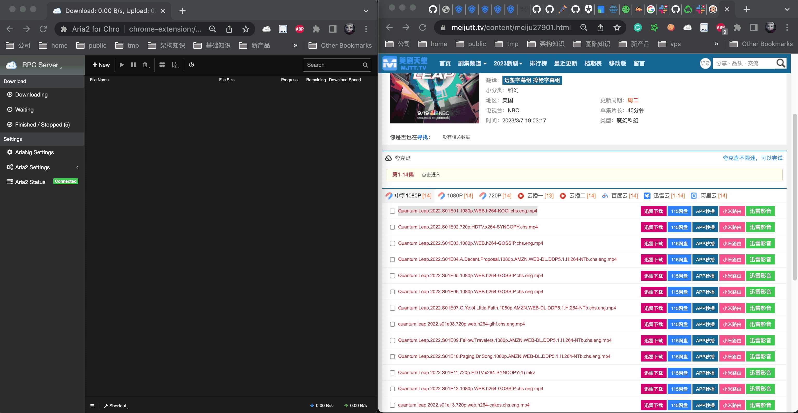

# aria2下载提供器安装和配置
## 简介
aria2 是一个轻量级的多协议和多源命令行下载实用程序。 它支持HTTP/HTTPS、FTP、SFTP、BitTorrent 和Metalink。 aria2 可以通过内置的JSON-RPC 和XML-RPC 接口进行操作。

## 最终效果
效果如图，结合aria下载软件，Kubespider会调用aria2，下载bt链接资源：


## 安装
### 1.安装aria2
在你通过 `install_kubespider.sh` 安装Kubespider后，aria2是默认安装的。

### 2.确认安装
运行如下命令，确认迅雷已经安装成功：
```sh
docker ps | grep aria2
```

输出类似：
```sh
root@cesign [10:49:25 PM] [+41.0°C] [~/kubespider/.config]
-> # docker ps | grep aria2
802bd72aeb42   cesign/aria2-pro:latest   "/init"   4 weeks ago   Up 11 days   aria2-pro
```

## 配置
### 1.通用配置
通过下载aria2 chrome插件，即可查看下载任务，其中配置在运行 `install_kubespider.sh` 后已输出：


### 2.Kubespider对接配置（可选）

aria2对应的配置文件如下：

```yaml
aria2:
  type: aria2_download_provider
  enable: true
  download_base_path: "/downloads/"
  rpc_endpoint_host: http://127.0.0.1
  rpc_endpoint_port: '6800'
  secret: kubespider
  priority: 1
```

其中:

* 名称，可自定义（不可重复），可以在 `source_provider.yaml` 中按名称指定下载器。
* `type`: 表示此下载器的类型，需为 `aria2_download_provider`。
* `enable`: 设置是否使用此provider，只能使用一个，后续开发优先级后可以多个一起使用。
* `download_base_path`: 设置下载基础路径，后续文件都将保存在该目录中，务必设置在你所挂载的nas目录或其他目录。
* `rpc_endpoint_host`: aria2 rpc地址。
* `rpc_endpoint_port`: aria2 rpc端口。
* `secret`: aria2 rpc接口密码。
* `priority`: 下载提供器优先级，数字越小，优先级越高，下载资源时按优先级尝试，无法下载或下载失败时切换下载器。


### 3.测试下载
配置好后，运行如下命令：
```
docker restart kubespider
```
按最终效果图测试一下即可。
