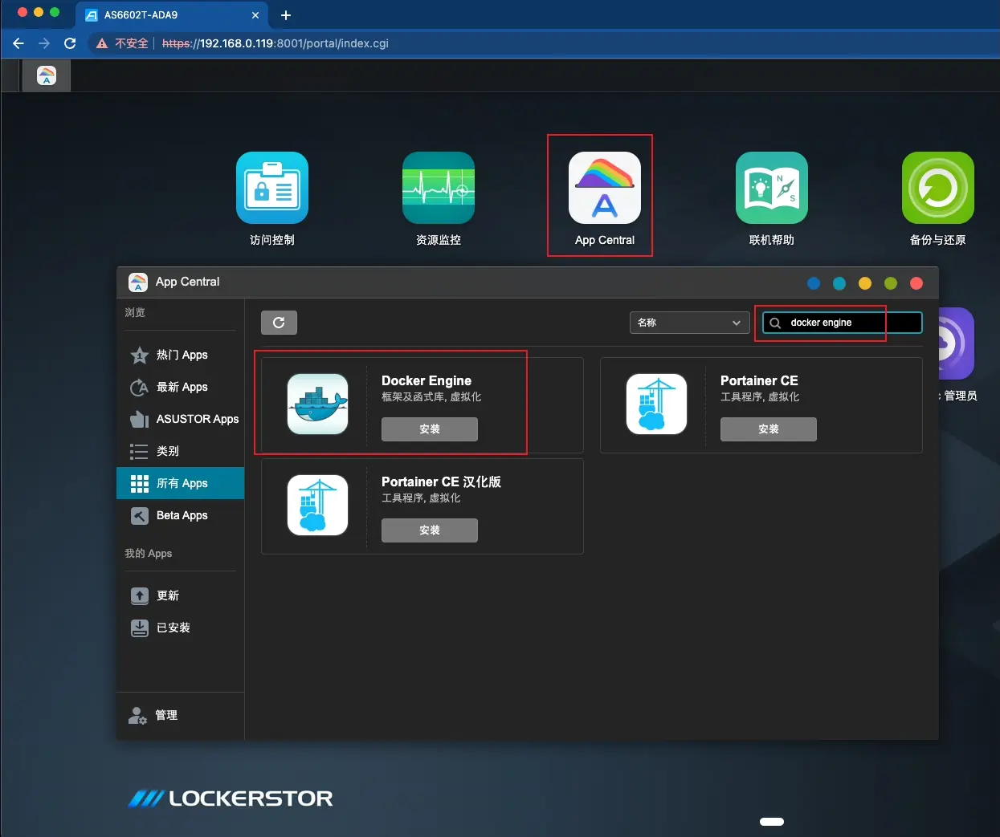
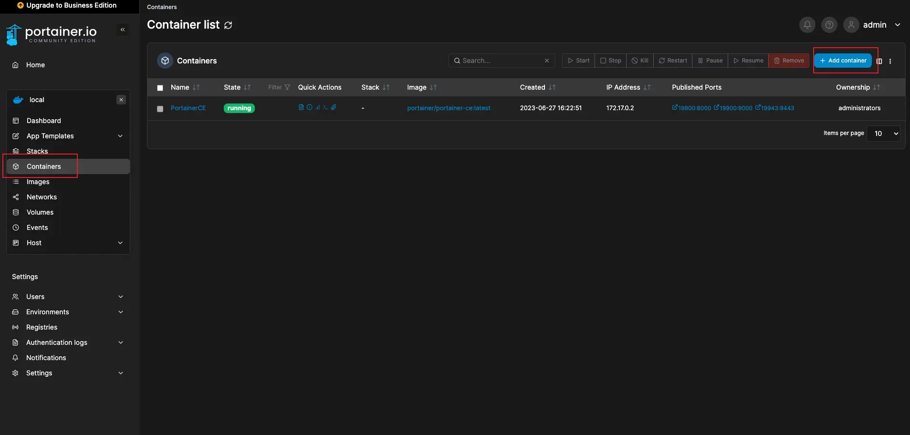
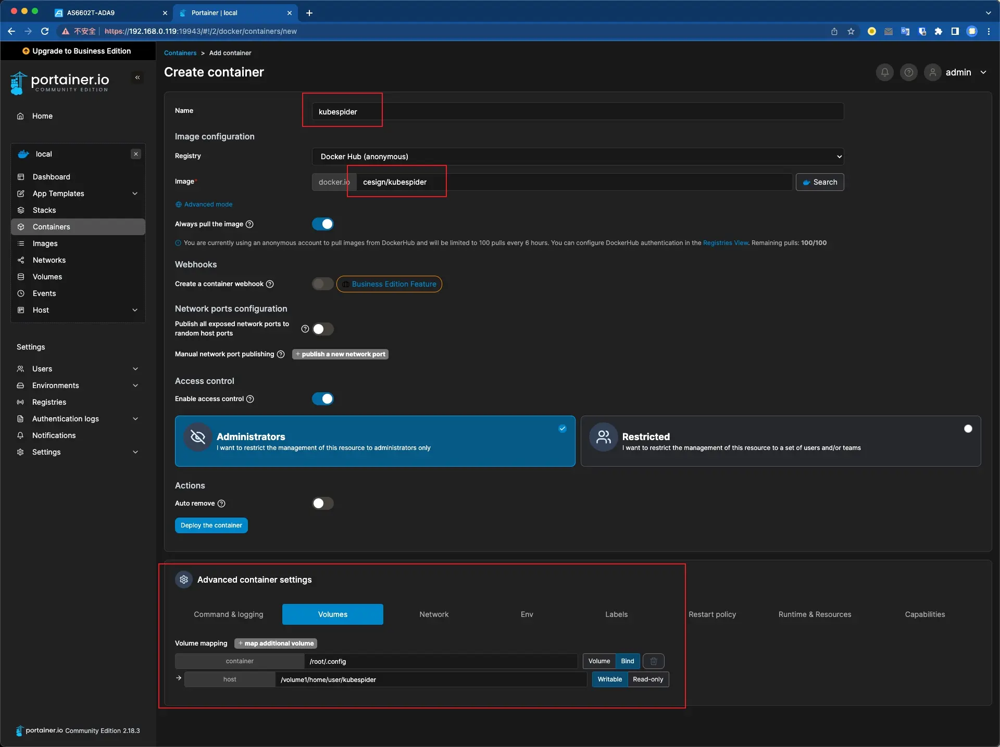

# Kubespider华芸Asustor NAS安装手册

本文档将介绍如何在[Asustor 华芸](https://www.asustor.com/zh-cn/)NAS上安装kubespider。

## 场景
对于NAS玩家，或多或少都有资源下载需求，包括但不限于： 
* 自动下载更新的TV/Movie/文件/其他，方便后续个人学习使用。
* 有一个大型文件或各式各样的文件下载，希望能方便的触发NAS机器下载。
* 自定义条件，自动触发下载相关资源，如自动下载豆瓣评分大于8的资源。
* 在某些资源网站上，有下载需求，如B站，YouTube，抖音等各种资源网站，供个人学习使用。
* 入门/资深网站玩家，需要对自己的账号维护，如自动刷上传下载量。

如果你有这些需求，那么Kubespider就是你要找的All-in-one的资源下载系统，打造属于自己的家庭NAS下载中心。

## 安装依赖项目

安装kubespeder需要以下依赖项目：

* 安装Docker
* 安装Portainer
* 安装任意文本编辑器

### 安装 docker

首先介绍如何在Asustor NAS上安装[docker engine](https://www.asustor.com/zh-cn/app_central/app_detail?id=891&type=1&model=)。

Kubespider需要使用docker环境才能运行，docker的介绍请参考[使用 ASUSTOR NAS 快速部署 Docker](https://www.asustor.com/zh-cn/solution/what_is_docker)。

在ADM的`App Central`中搜索docker engine并安装。

### 安装 Portainer

同样的，在ADM的`App Central`中搜索`portainer`安装即可。

## 安装kubespider

安装完Docker engine 和 portainer 之后，即可开始准备安装kubespider。

### 准备配置目录

首先在ADM的`文件总管`中，在`Public`目录下面新建一个文件夹，命名为`kubespider`，作为配置存放的地点；新建另一个文件夹命名为`data`，作为下载目录。

### 使用 portainer 安装 kubespider

安装完 portainer 之后，在ADM桌面会看到新出现的 portainer 图标，双击即可打开 portainer 的控制页面。点击左侧的`local/Containers`，然后点击右边的`Add container`，打开创建页面。

在新打开的页面中，在Name区域自行输入新容器的名字，此处为kubespider；

在image区域中输入`cesign/kubespider:latest`，用来下载最新版本的kubespider；

在页面的尾部，点击`Volumes`标签，点击一次`map additional volume`并切换到`Bind`模式，在第一个输入框中输入`/root/.config`，在第二个输入框中输入刚刚创建的配置文件夹路径，截图中的user为创建文件夹时登录的用户，需自行调整。路径可以在ADM 文件总管中，对着此文件夹点击右键->属性中查看，实际地址为 `地址 + / + 名称`。

输入完成后 ，点击页面中部的 `Deploy the container` 即可。

稍作等待后，在`Container list`页面中看到刚刚创建的`kubespider`并显示running，即表示创建成功。

### 安装aria2下载器

kubespider至少需要1个下载器才能正常运行，用户可以使用portainer安装一个aria2作为下载器。

具体安装方式，请参考[docker-aria2-with-webui的介绍](https://hub.docker.com/r/abcminiuser/docker-aria2-with-webui)进行安装。注意将其中的`/DOWNLOAD_DIR`替换为前面创建的`data`文件夹的路径。

### 配置kubespider

#### 下载器配置

请参考[aria2下载提供器安装和配置](../aria2_download_provider/README.md#2kubespider对接配置可选)，在本地准备一份配置文件，并命名为`download_provider.yaml`，随后通过ADM文件管家上传到刚刚创建的`kubespider`文件夹中。

#### 资源配置

请参考[资源提供器配置介绍](../../../../README-CN.md#资源提供器按需配置)，根据你需要的资源类型，在本地准备一份配置文件，并命名为`source_provider.yaml`，随后通过ADM文件管家上传到刚刚创建的`kubespider`文件夹中。

#### 开始使用

完成以上配置后，在portainer中点击kubespider并选择重启，重启完成后即可开始你的kubespider使用了。

## 结语

kubespider具有丰富的配置功能，用户可在仔细阅读项目的[说明文档](../../../../README-CN.md)后自行调整配置参数，以获得最佳使用体验。

本文档在[Asustor 华芸公司](https://www.asustor.com/zh-cn/)的支持下编写。
