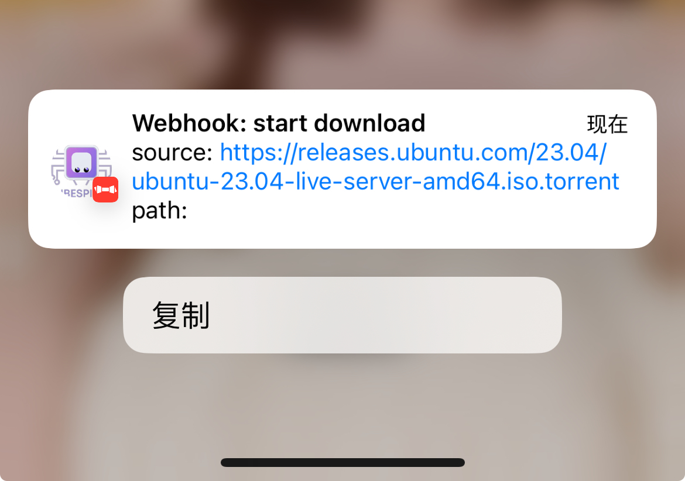

# [Bark](https://bark.day.app/)

Bark是iOS上一款注重隐私、安全可控的自定义通知推送工具。

- 免费、轻量！简单调用接口即可给自己的iPhone发送推送。
- 依赖苹果APNs，及时、稳定、可靠
- 不会消耗设备的电量， 基于系统推送服务与推送扩展，APP本体并不需要运行。
- 隐私安全，可以通过一些方式确保包含作者本人在内的所有人都无法窃取你的隐私。


### 效果



### 将 Bark 接入 Kubespider 

将 Bark 作为消息推送 provider 接入 Kubespider：

```yaml
bark:
  type: bark_notification_provider
  enable: false
  host: https://api.day.app（官方默认地址）
  device_token: XXXX（从你的设备上复制）
```

### 自架服务器端
参考Bark官方文档, 替换配置里的`host`参数

