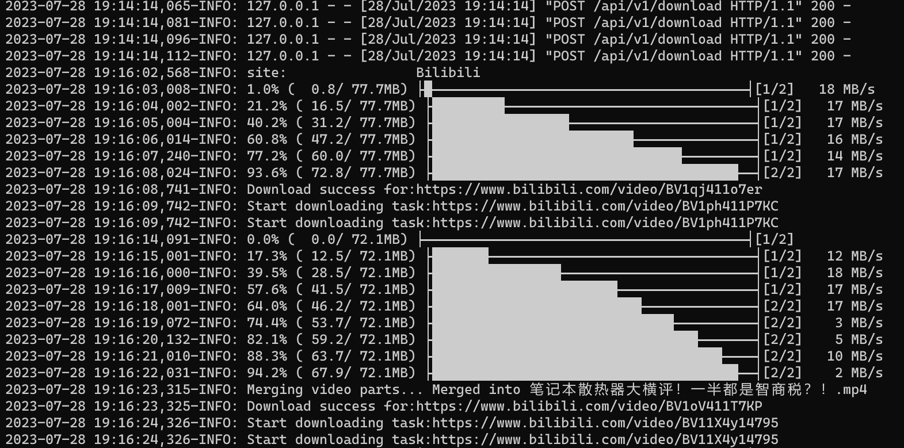
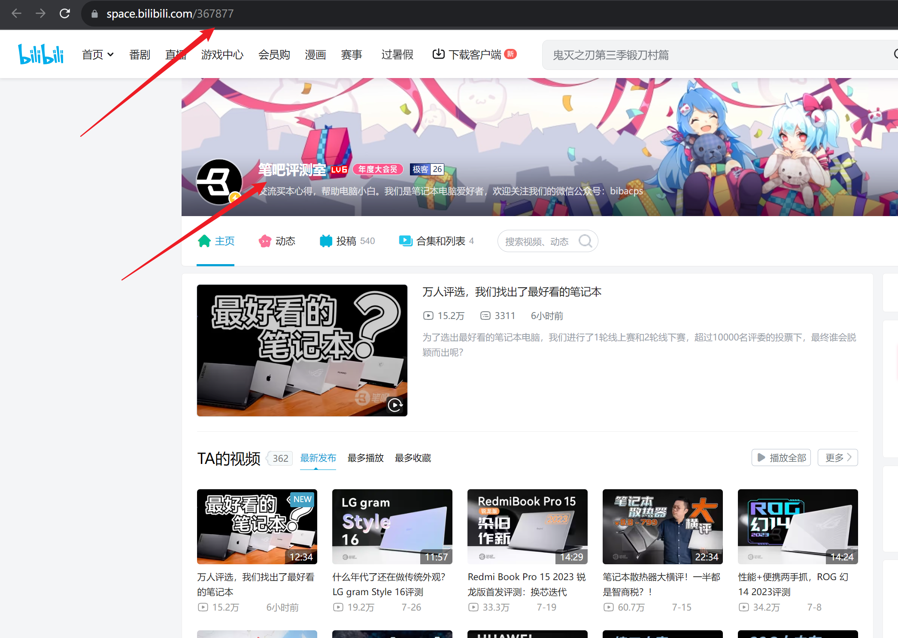

# Bilibili博主追更资源提供器
## 简介
B站上面有许多优秀的博主，有时期待自动下载更新的视频。所以本资源提供器旨在实现**自动下载博主更新视频**，简化下载流程。

## 最终效果
最终效果如下图，在配置好后，会自动检查博主更新视频，自动下载（此处借助yutto下载）：


## 配置
### 1.前提
1. 你已经安装好了Kubespider/Kubespider chrome插件。
2. 配置安装好yutto downloader，如果没有请参考 [link](../yutto_download_provider/README.md)

### 2.配置手册
你可以通过`${HOME}/kubespider/.config/source_provider.yaml`配置，配置解释如下：
```yaml
bilibili_vlogger_subscribe_source_provider:
  type: bilibili_vlogger_subscribe_source_provider
  enable: false
  downloader: yutto
  vlogger:
    - 367877
```

* `type`：订阅源类型，需为`bilibili_vlogger_subscribe_source_provider`。
* `enable`：是否开启此provider，因为此provider无需口令等用户信息，所以默认开启。
* `downloader`：指定使用的下载器，内容需要精确地跟 `downloader_provider.yaml` 中声明的名称一样；下载优先级将由数组顺序决定。
* `vlogger`：需要下载的博主ID，通过博主主页url获取，如下为367877：
  
  如果你想设置多个博主，可以如下配置：
  ```yaml
  bilibili_vlogger_subscribe_source_provider:
  type: bilibili_vlogger_subscribe_source_provider
  enable: false
  downloader: yutto
  vlogger:
    - 367877
    - 367878
  ```


## 测试
设置好后，保存文件后Kubespider会自动启动，触发下载，并追更。你可以通过查看yutto下载器的日志查看下载进度：

```sh
$ docker logs -f yutto
```

默认下载路径为 `VideoMixed`。