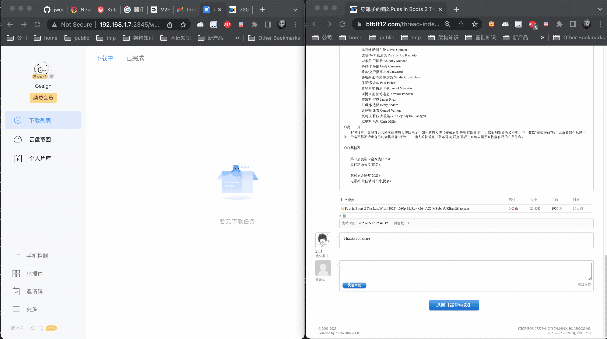

# btbtt12单任务资源提供器配置
## 简介
BT之家单版社区平台，最快提供最新最全高清电影、动漫、韩剧、日剧、美剧、无损音乐、体育、小说等BT迅雷下载以及资讯！官方地址：[btbtt12.com](https://www.btbtt12.com/)  
本资源提供器旨在实现**链接触发下载**，简化下载流程。

## 最终效果
最终效果如下图，在Chrome中右键，选择`Send to Kubespider`，Kubespider会自动下载链接中的资源。


## 配置
### 1.前提
你已经安装好了Kubespider/Kubespider chrome插件。

### 2.配置手册
你可以通过`${HOME}/kubespider/.config/source_provider.cfg`配置，配置解释如下：
```yaml
btbtt12_disposable_source_provider:
  type: btbtt12_disposable_source_provider
  enable: true
```

* `type`：订阅源类型，需为`btbtt12_disposable_source_provider`。
* `enable`：是否开启此provider，因为此provider无需口令等用户信息，所以默认开启。

## 测试
设置好后，直接重启Kubespider即可。
```sh
docker restart kubespider
```

安装最终效果测试即可。