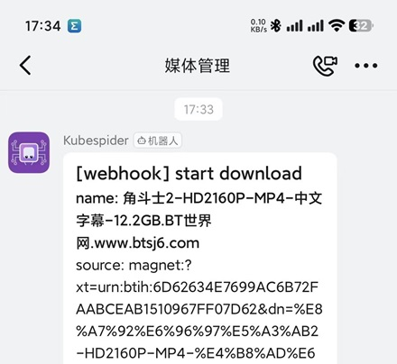
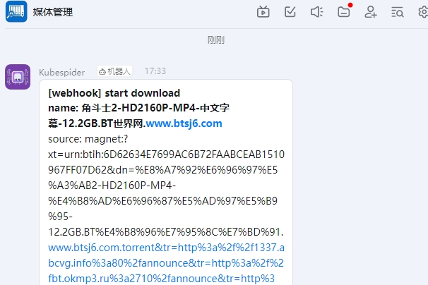
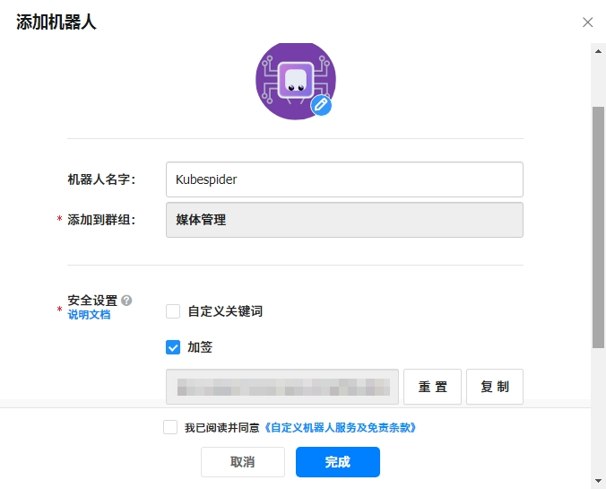

# 钉钉（Dingtalk） webhooks

钉钉（没什么好说的，作为添加者表示铃声听着烦，要不是Slack推送对国内安卓不友好。企业微信越来越麻烦.....我更喜欢飞书的显示效果）

# 效果如图

|             移动端             |                    桌面端                     |
| :----------------------------: | :-------------------------------------------: |
|  |  |

# 使用说明

### 钉钉 部分

- 在群聊中添加自定义webhook机器人

  

  ##### 【注意】钉钉特性，安全设置中`加签` 或 `自定义关键词`  **二选一**，`自定义关键词`务必设置成：`webhook`，不然钉钉不会发送消息

  

### 将 自定义机器人 webhooks 接入 Kubespider

- 复制 机器人`Webhook URL`

- 修改 Kubespider 中 notification_provider.yaml 配置文件

```yaml
dingtalk:
  type: dingtalk_notification_provider
  enable: false
  token: 只需填写授权码部分，如：https://oapi.dingtalk.com/robot/send?access_token=XXXXXXX，授权码则是XXXXXX部分
  secret: 选填。创建时没有设置加签，则填none
```

### 配置说明

- `type`: 消息通知提供器的类型。**（无需更改）**
- `enable`: 消息通知提供器是否启用，**true**为启用，**false**为关闭。
- `token`: **Webhook 的授权码**，如：access_token=XXXXXXX中的`XXXXX`
- `secret`: 如果设置了加签，把密钥填在此处，如果没设置则填`none`
