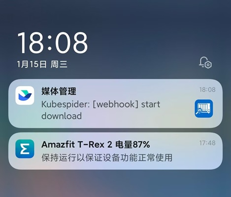
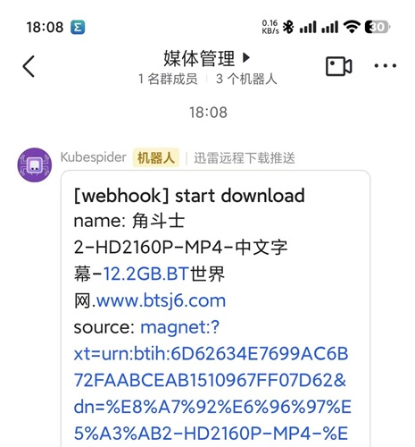
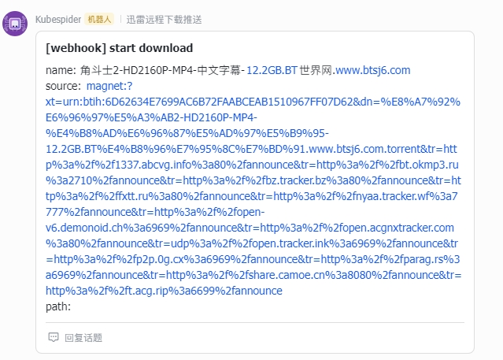
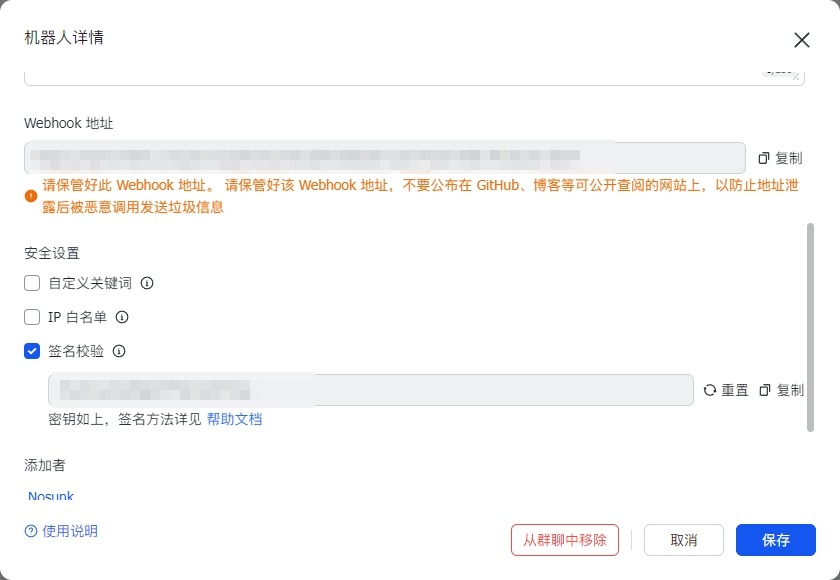

# 飞书（Feishu） webhooks

（感觉比钉钉显示效果好，可以以话题的显示方式，其次办公没用飞书，对它没啥厌恶的感觉）

# 效果如图

|                            移动端                            |           桌面端            |
| :----------------------------------------------------------: | :-------------------------: |
|  |  |

# 使用说明

### 飞书 部分

- 在群聊中添加自定义webhook机器人

  

  ##### 【注意】飞书不会像钉钉强行让你选择一项安全设置，可以自行抉择要不要设置

  

### 将 自定义机器人 webhooks 接入 Kubespider

- 复制 机器人`Webhook URL`

- 修改 Kubespider 中 notification_provider.yaml 配置文件

```yaml
feishu:
  type: feishu_notification_provider
  enable: false
  token: 只需填授权码部分，如https://open.feishu.cn/open-apis/bot/v2/hook/XXXXXXX，授权码则是XXXXXX部分
  secret: 选填。创建时没有设置，则填none
```

### 配置说明

- `type`: 消息通知提供器的类型。**（无需更改）**
- `enable`: 消息通知提供器是否启用，**true**为启用，**false**为关闭。
- `token`: **Webhook 的授权码**，如：access_token=XXXXXXX中的`XXXXX`
- `secret`: 如果设置了加签，把密钥填在此处，如果没设置则填`none`
