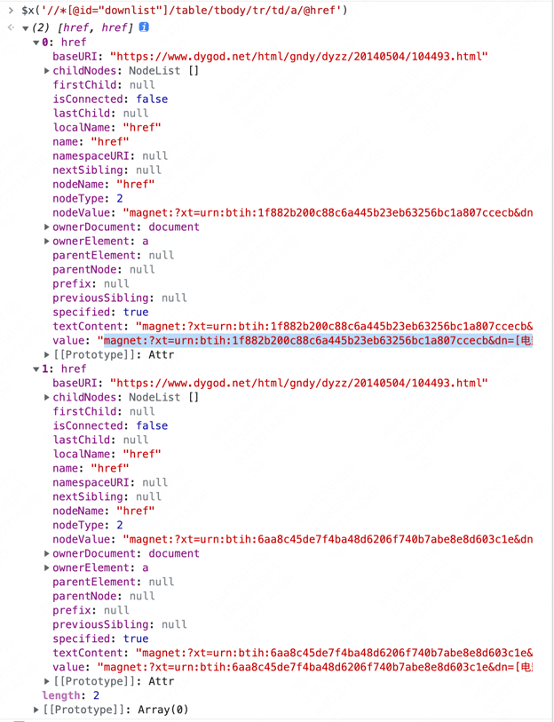
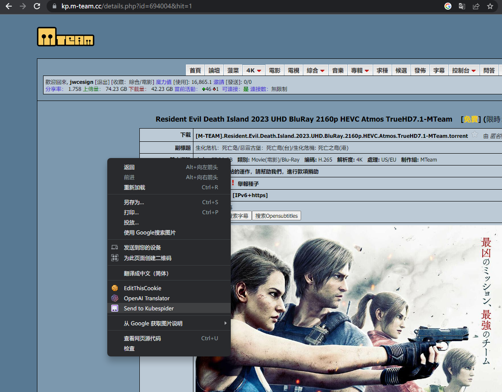
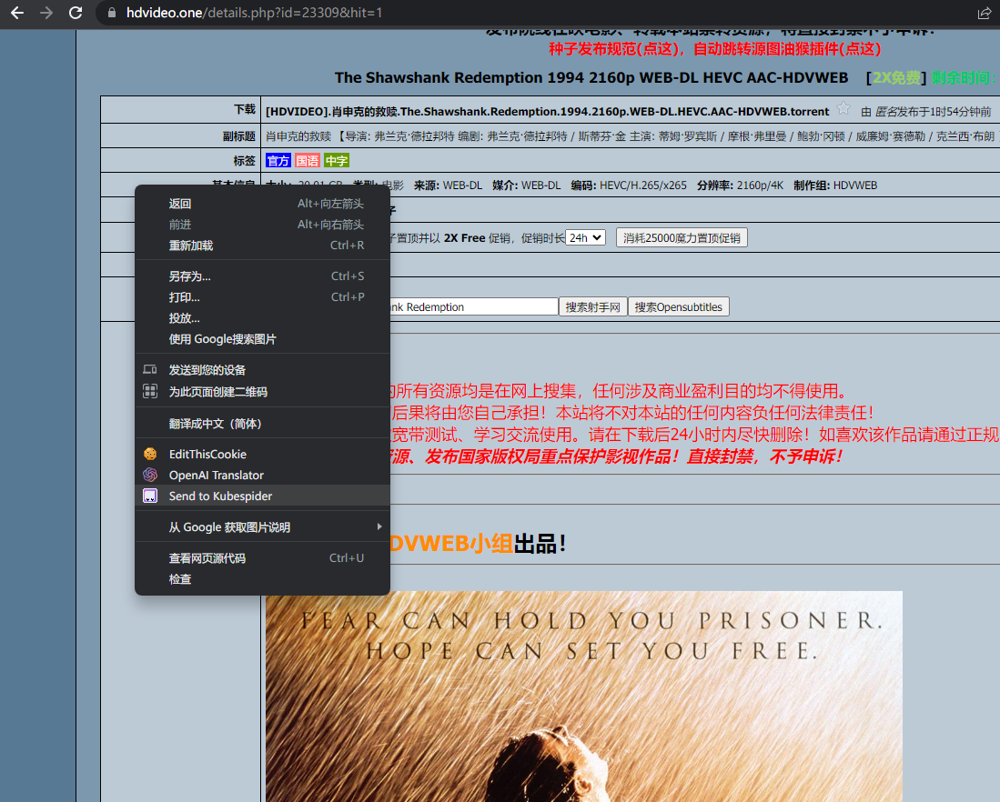

# magic资源提供器配置

## 简介

本资源提供器旨在提供更泛用的高度自解析提供器，以解析各种类型的资源网站。通过自定义XPath来解析资源并获取链接，从而触发下载。

## 最终效果

最终效果如下图，在Chrome中右键，选择Send to Kubespider，Kubespider会自动根据xpath配置下载资源。


## 配置

### 1.前提

你已经安装好了Kubespider

### 2.配置手册

你可以通过`${HOME}/kubespider/.config/source_provider.yaml`配置，普通配置如下（以dygod为例）：

```yaml
dygod_magic_source_provider:
  enable: false
  type: magic_source_provider
  handle_host: www.dygod.net
  link_selector: //*[@id="downlist"]/table/tbody/tr/td/a/@href
  title_selector: //*[@id="header"]/div/div[3]/div/div[4]/div[1]/h1/text()
```

* `enable`：是否开启此provider
* `type`：订阅源类型，需为`magic_source_provider`
* `handle_host`: 资源网站域名
* `link_selector`: 资源链接xpath
* `title_selector`: 资源标题xpath
  可选配置
* `downloader`: 数组格式，指定下载器，必须是在`${HOME}/kubespider/.config/downloader_provider.yaml`配置中的下载器。
* `download_param`: 下载器参数配置，具体参数请参考下载器配置。
* `link_type`: 资源链接类型，可选`magnet`、`torrent`、`general`，默认为`magnet`。
* `file_type`: 对应资源文件类型，可选`general`、`movie`、`tv`、`video_mixed`、`music`、`picture` ，默认为`video_mixed`。
* `charset`: 站点编码格式，默认为`utf-8`。

### 3.测试

设置好后，按照最终效果测试即可。

## 友情提示

### 1.如何获取xpath

如不知道如何配置xpath，可以使用chrome devtool -> copy xpath 进行xpath复制。


但复制的xpath可能需要微调，具体请参考[xpath文档](https://www.w3.org/TR/xpath-31/#id-path-expressions)

### 2.如何验证xpath是否符合预期

可以使用chrome devtool -> console -> $x(xpath)进行xpath验证，检查输出数组中每个元素的value是否符合预期。



## 收录配置

### 馒头资源网站(https://kp.m-team.cc)
PT资源站，包含各类资源，关键配置如下：
```yaml
mteam_magic_source_provider:
  charset: utf-8
  cookie: {config needed}
  downloader: {config needed}
  enable: true
  file_type: {config needed}
  handle_host:
  - kp.m-team.cc
  link_selector: //*[@id="outer"]/table[1]/tr[5]/td[2]/a[1]/@href
  link_type: torrent
  title_selector: //*[@id="top"]/text()
  type: magic_source_provider
```
* `downloader`: 建议使用 transmission 下载软件.  


### hdvideo(https://hdvideo.one)
PT资源站，主要包含电影和电视剧，关键配置如下：
```yaml
hdvideo_magic_source_provider:
  charset: utf-8
  cookie: {config needed}
  downloader: {config needed}
  enable: true
  file_type: {config needed}
  handle_host:
  - hdvideo.one
  link_selector: //*[@id="outer"]/table[2]/tr[5]/td[2]/a[1]/@href
  link_type: torrent
  title_selector: //*[@id="top"]/text()
  type: magic_source_provider
```
* `downloader`: 建议使用 transmission 下载软件.  
