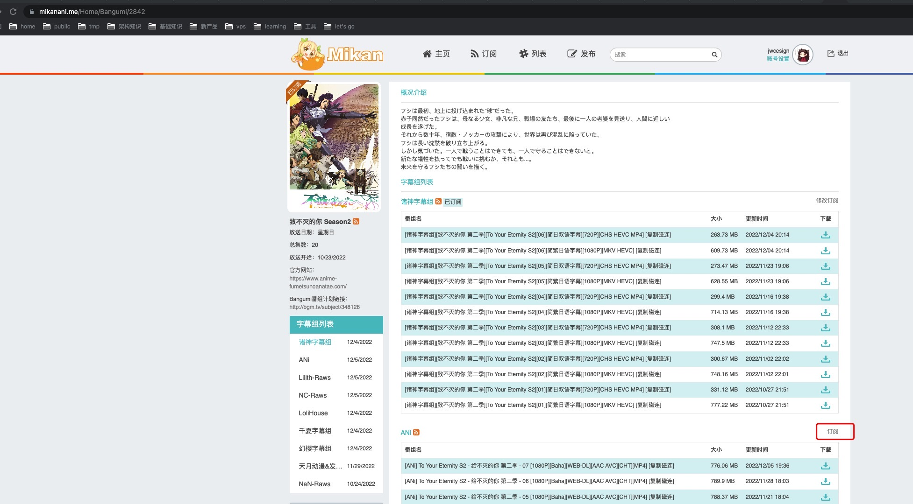

# mikanani资源提供器配置
## 简介
蜜柑计划是新一代的动漫下载站，专业提供动漫、动漫下載、新番下载、动画下载等服务。官方地址：[mikanani.me](https://mikanani.me/)  
本资源提供器旨在实现**全自动追番**，当你订阅的动漫有更新时，自动下载，你能随时方便的观看。

## 前提
你已经安装好了Kubespider。

## 配置手册
你可以通过`/root/.kubespider/source_provider.cfg`配置，配置解释如下：
```cfg
{
   ...
    "mikanani_source_provider": {
        "enable": false,
        "rss_link": "https://mikanani.me/RSS/MyBangumi?token=egIVi24Uxfg68bFDW5ehVgpHCadfZ1AULNYot%2b95mDo%3d"
    },
    ...
}
```

`enable`：是否开启此provider。  
`rss_link`：mikanani账号的rss链接，获取方法如下：  

1. 去[mikanani](https://mikanani.me/)注册账号，开启高级订阅 
   
2. 关注你喜欢的动漫
   
3. 查看RSS链接，选择复制链接地址并设置为`rss_link`即可
   

## 启用配置
设置好后，直接重启Kubespider即可。
```sh
docker restart kubespider
```
