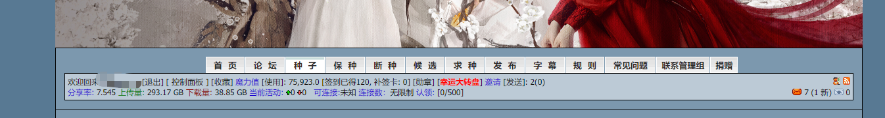
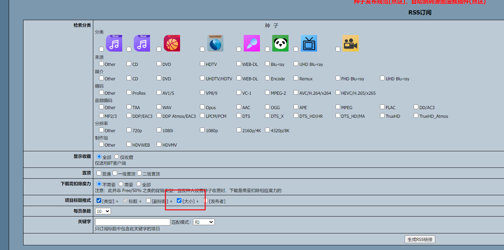
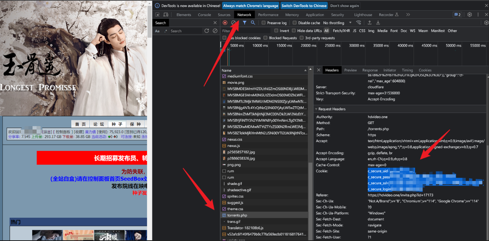
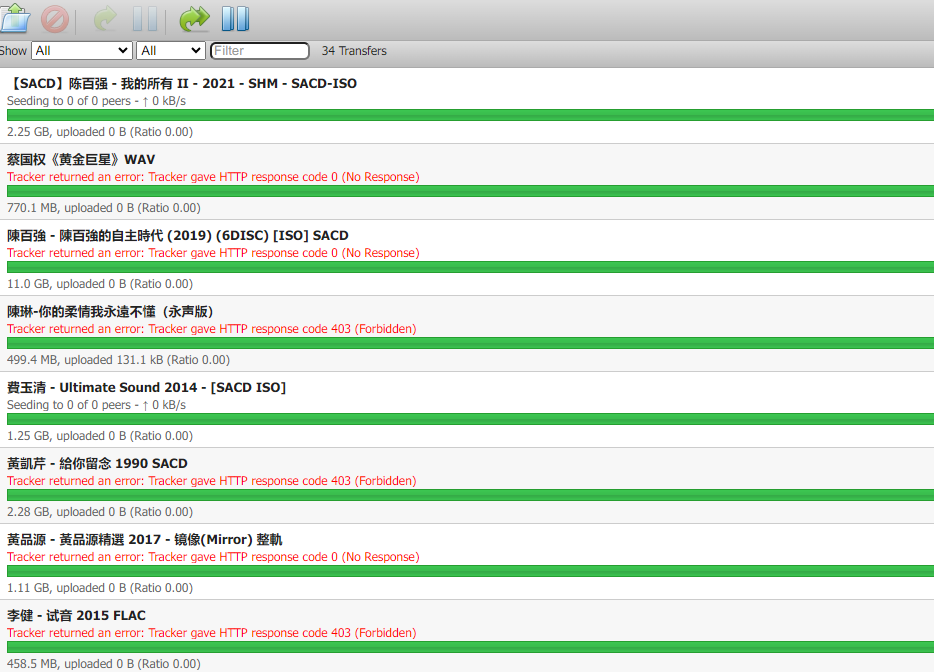

# NEXUSPHP PT提供器配置

## 简介
许多PT网站，都有上传流量、下载流量，魔力值的要求，这些如果靠人工手动管理，会非常的麻烦。此提供器旨在简化 NEXUSPHP 框架类PT网站的账号维护流程，将前面所述的流程全自动化。

## 最终效果
最终效果如下图所示，配置好后，会自动做账号维护，刷上传流量，下载流量和魔力值：



## 配置
### 1.前提
你已经安装好了Kubespider。同时，每个PT站，都建议使用单独的下载提供器，这里以 [hdvideo](https://hdvideo.one/) 为例，为其单独启动一个 transmission 类型的下载提供器，运行如下命令即可（注意映射端口）：
```sh
DEFAULT_VERSION=${DEFAULT_VERSION:-2.94-r1-ls24}
KUBESPIDER_HOME=${KUBESPIDER_HOME:-${HOME}}

docker run -d \
  --name=transmission \
  -e PUID=$UID \
  -e PGID=$GID \
  -e TZ=Asia/Shanghai \
  -e USER=admin \
  -e PASS=admin \
  -p 9092:9091 \
  -v ${KUBESPIDER_HOME}/kubespider/transmission-hdvideo/:/config \
  -v ${KUBESPIDER_HOME}/kubespider/nas/:/downloads \
  --restart unless-stopped \
  linuxserver/transmission:${DEFAULT_VERSION}
```

### 2.配置手册
这里，需要配置2个配置文件，`${HOME}/kubespider/.config/pt_provider.yaml`和`${HOME}/kubespider/.config/download_provider.yaml`。

#### pt_provider.yaml配置
整体配置如下：
```yaml
hdvideo:
  type: nexusphp_pt_provider
  enable: true
  attendance: true
  main_link: https://hdvideo.one
  rss_link: xxx
  cookie: xxx
  # I suggest you to use transmission type, and also,
  # do not use this downloader to download the resource you needed.,
  # only for PT provider
  downloader: transmission-hdvideo
  # time in hour for seeding and downloading
  keeping_time: 120
  # size in GB
  max_sum_size: 200
  # the sized needed to be download, size in GB
  cost_sum_size: 0
```
* type: 必须为 `nexusphp_pt_provider`。
* enable: 控制是否启用此提供器。
* attendance: 是否执行签到，此配置需要根据具体资源网站是否支持签到配置。
* main_link: 资源网站主页地址。
* rss_link: 资源订阅rss地址，这里尽量保证获取的内容中存在free类型的资源，如馒头，尽量订阅 music 类型的资源（存在大范围free）。同时RSS链接中包含文件大小信息，如下：  
  
* cookie: 资源网站Cookie地址，获取方式为 F12查看cookie即可：
  
  示例为：`c_secure_uid=xxx; c_secure_pass=xxx; c_secure_ssl=xxx; c_secure_tracker_ssl=xxx; c_secure_login=xxx`
* downloader: 知道下载使用的下载提供器，这里会使用前面创建的transmission。
* keeping_time: 下载和做种时间，建议不修改。
* max_sum_size: 每轮下载和做做的所有资源大小总和，根据你自己的磁盘大小决定。
* cost_sum_size: 非免费资源的下载大小，根据各网站要求决定。

#### download_provider.yaml配置
前面配置了PT提供器，这里还需要配置对应的下载提供器：
```yaml
transmission-hdvideo:
  type: transmission_download_provider
  enable: true
  download_base_path: "/downloads/"
  http_endpoint: http://127.0.0.1:9092/transmission/rpc
  username: admin
  password: admin
  priority: 5
```
* type: 下载提供器类型，建议使用 `transmission_download_provider`。
* enable: 控制是否启用此提供器。
* download_base_path: 下载资源的根目录路径。
* http_endpoint: 下载资源的地址，这里前面启动了一个transmission，端口对应即可。
* username: 下载资源的用户名。
* password: 下载资源的密码。
* priority: 下载软件资源的优先级，随便设置即可。

## 测试
设置好后，等一段时间，访问 `http://<server_ip>:9092` 即可看到触发下载的资源，用作账号维护：



