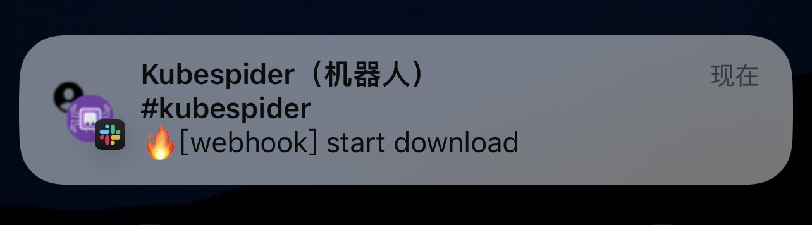
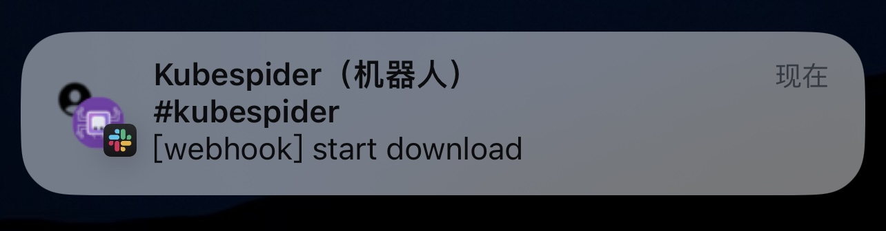
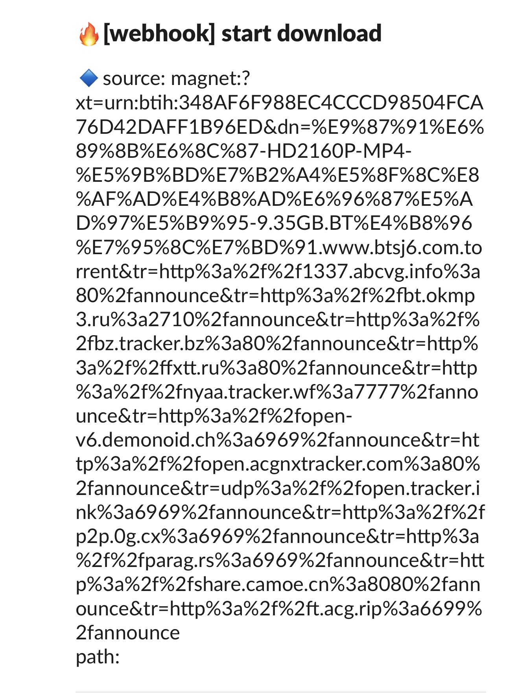
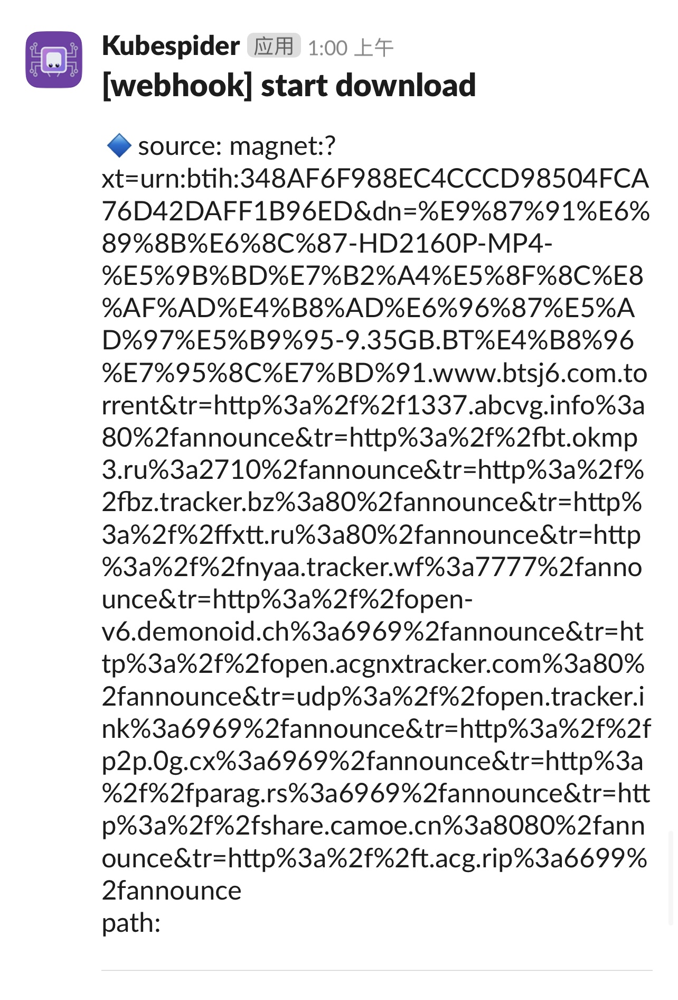

# Slack webhooks

Slack 是一款团队协作软件，它集成了聊天群组、大规模工具集成、文件整合和统一搜索、机器人等功能。

官方网站：[https://slack.com](https://slack.com)

支持：

- **iOS**
- **Mac**
- **Android**
- **Windows**
- **Linux**
- **浏览器通知**

Android APK（此处为 SoftPedia 下载 slack，官网为 Google play 下载）：[下载地址](https://mobile.softpedia.com/apk/slack/#download)

> **推荐**使用 IOS 客户端，苹果推送通知服务，无需后台常驻
> Android 大概率可能需要锁定后台运行

> ⚠️ **Slack 不允许使用 QQ 邮箱注册**

# 效果如图

|                      带Emoji通知                       |                       无Emoji通知                        |
| :----------------------------------------------------: | :------------------------------------------------------: |
|  |  |
|   |  |

# 使用说明

#### _此处不涉及创建 Slack 工作区、频道、APP_

### slack 部分

- [slack app 入口](https://api.slack.com/apps)

- 创建新的 APP 和频道（频道可以利旧）

- 在 app 中启用`Incoming Webhooks`授权及绑定频道

### 将 Slack webhooks 接入 Kubespider

- 复制 Slack APP 的`Webhook URL`

- 修改 Kubespider 中 notification_provider.yaml 配置文件

```yaml
slack:
  type: slack_notification_provider
  enable: false
  host: https://hooks.slack.com/services/XXXXXXXXXX
  channel: channel_name
  username: bot_name
  title_emoji: none/emoji_name
```

### 配置说明

- `type`: 消息通知提供器的类型。**（无需更改）**
- `enable`: 消息通知提供器是否启用，**true**为启用，**false**为关闭。
- `host`: Slack 中 App 的**Webhook URL**，如：https://hooks.slack.com/services/XXXXXXXXXX
- `channel`: Slack App 绑定的消息频道（允许包含中文）。
- `username`: Slack App 推送机器人的名称，当一个频道有多个 App 时，可以进行命名分辨，一般情况可以直接用`Kubespider`命名
- `title_emoji`: Slack App推送通知是否使用Emoji表情，`none`为不使用，如需使用请输入Emoji名称

### Emoji表情参考

| Emoji名称 |         fire         |     floppy_disk      |         clapper         | eight_pointed_black_star |
| :-------: | :------------------: | :------------------: | :---------------------: | :----------------------: |
| 表情样式  |  |  |  |     |

更多表情，请自行在Slack中查看