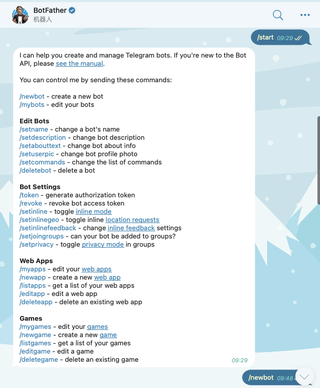
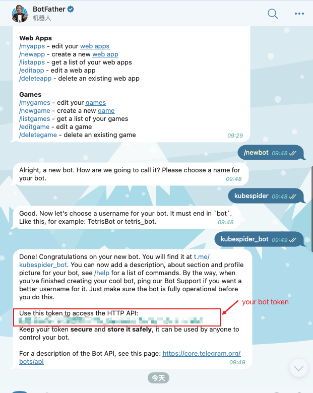
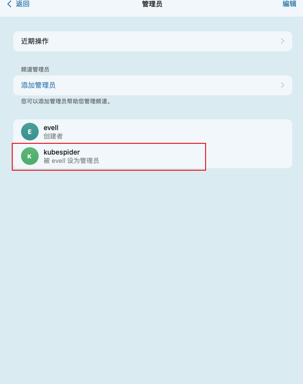

# Telegram

Telegram notification provider 提供了 Telegram 消息推送接入

接入步骤:

### 创建机器人

添加 [@BotFather](https://telegram.me/BotFather)





完成上述步骤,即可完成bot的创建,以及得到了bot的token

### 创建频道

创建一个频道，把创建的机器人添加进去

把机器人设置为频道管理员，否则无法发送消息

频道设置为公开
 




完成上述步骤之后在频道内随便发送一句话

---

### 将 Telegram 接入 Kubespider 

将 Telegram 作为消息推送 provider 接入 Kubespider：

```yaml
telegram:
  bot_token: your bot token
  channel_chat_id: 
  channel_name: your channel name
  enable: false
  host: https://api.telegram.org
  type: telegram_provider
```
这里包含6个配置属性：
* `bot_token`: 机器人的token。
* `channel_chat_id`: 需要推送消息的频道id,这个字段需要通过接口获取,这里置空。
* `channel_name`: 频道名称。
* `enable`: 是否启用。
* `host`: Telegram host。
* `type`: provider 类型。

### 初始化

channel_chat_id 普通用户无法获取,所以要在第一次运行 telegram provider 的时候进行初始化。
telegram provider 会通过机器人token查询update记录,上面在群聊里发送消息之后这里就能查询到message记录,从message记录里面可以提取到chat_id。
取到chat_id之后,会把chat_id写入配置文件,然后触发服务重启。

### 问题排查

如果遇到chat_id获取失败报错,可以检查token是否正确,频道名称是否正确,在频道内发送消息后再尝试。
