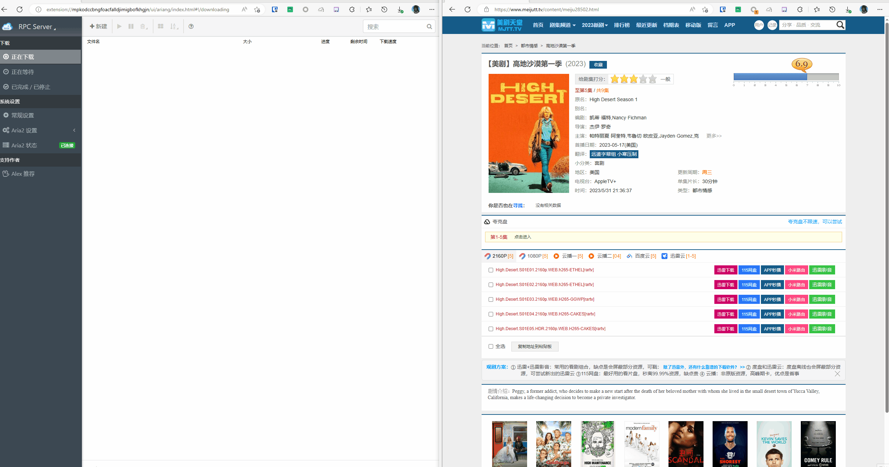

# Kubespider铁威马NAS安装手册

## 场景
对于NAS玩家，或多或少都有资源下载需求，包括但不限于： 
* 自动下载更新的TV/Movie/文件/其他，方便后续个人学习使用。
* 有一个大型文件或各式各样的文件下载，希望能方便的触发NAS机器下载。
* 自定义条件，自动触发下载相关资源，如自动下载豆瓣评分大于8的资源。
* 在某些资源网站上，有下载需求，如B站，YouTube，抖音等各种资源网站，供个人学习使用。
* 入门/资深网站玩家，需要对自己的账号维护，如自动刷上传下载量。

如果你有这些需求，那么Kubespider就是你要找的All-in-one的资源下载系统，打造属于自己的家庭NAS下载中心。

<!-- 安装步骤 -->
## 安装步骤

### 1. 安装Docker套件
`Kubespider`使用Docker安装部署，需要安装Docker套件。铁威马的TOS系统原生支持Docker，并且安装十分方便。进入铁威马后台桌面，打开应用中心，寻找Docker Manager的应用套件，点击安装即可

<image src="./images/terramaster_install_docker.png" alt="安装Docker">  

安装完成后，在后台桌面上会出现Docker的图标

### 2. 开启SSH服务

由于铁威马系统的开放性，可以直接使用SSH登录铁威马系统后台，通过命令行的方式进行安装，后续除了创建共享文件夹的操作需要使用桌面环境之外，其他安装步骤均使用SSH进行。

首先需要开启铁威马的SSH端口权限，进入铁威马后台桌面，打开控制面板，点击服务，找到SSH服务，右上角点击启动

<image src="./images/terramaster_enable_ssh.png" alt="开启SSH服务">

从选项中可以看到铁威马默认SSH端口为9222而不是Linux默认使用的22端口，请务必记住。随后选择一个自己喜欢的SSH工具如：Xshell、Putty，我这里使用Windows Terminal，直接输入以下命令进入铁威马控制台
```shell
ssh -p 9222 username@terramaster-ip
```
其中`username`为初始化铁威马系统时创建的账号，`terramaster-ip`为铁威马的IP地址，密码为创建账号的密码。如果遇到保存相关凭证信息时，输入yes即可。

<image src="./images/terramaster_connect_ssh.png" alt="SSH连接铁威马后台系统">

进入后台后，输入以下命令检查Docker是否正常运行
```shell
docker ps
```

### 3. 设置共享文件夹
`Kubespider`通过配置文件进行下载工作，由于铁威马的应用市场中还未上架有关编辑器的应用，因此我们需要在共享文件夹中创建`Kubespider`的安装目录以及配置文件，方便我们在其他系统对`Kubespider`进行配置

首先任意选择一个共享的文件夹，在文件夹中创建一个目录用于保存后续的配置文件。例如，创建一个名为`nas`的共享文件夹，设置好权限以及空间大小配额后，大小请自行控制，启动共享

<image src="./images/terramaster_create_smb.png" alt="创建共享文件夹">

<image src="./images/terramaster_smb_cap.png" alt="设置共享文件夹容量">  

此时我们可以通过smb协议对该共享文件夹进行挂载，以Windows为例，打开文件资源管理器（我的电脑），在此电脑选项右键，选择映射网络驱动器

<image src="./images/terramaster_windows_drive.png" alt="Windows挂载共享文件夹1">  

输入铁威马的IP地址以及共享文件夹的地址，例如`\\192.168.1.170\nas`，进行连接，如果是初次连接需要输入初始化铁威马系统时创建的账号信息

<image src="./images/terramaster_windows_mount_nas.png" alt="Windows挂载共享文件夹2">  

### 4. 正式安装
`Kubespider`提供一键安装脚本，如需自定义安装，可以参考第二个章节
#### 4.1 一键安装
由于铁威马应用市场未提供`git`套件，因此我们需要手动下载`Kubespider`代码

通过SSH连接铁威马后台，在刚刚创建的共享文件夹中创建`kubespider`文件夹，下载并解压`Kubespider`
```shell
cd /Volume1/nas && mkdir kubespider && cd kubespider
ter_wget https://github.com/opennaslab/kubespider/archive/refs/heads/main.zip
# 如果下载速度缓慢，可以使用代理下载
# ter_wget https://ghproxy.com/https://github.com/opennaslab/kubespider/archive/refs/heads/main.zip
unzip main.zip && rm main.zip
```

下载完毕之后，我们需要配置一下`kubespider`和默认下载器`aria2`的安装环境变量，有关`kubespider`的配置文件以及`aria2`的配置和下载文件都将保存在该环境变量路径之下
```shell
export KUBESPIDER_HOME=$PWD
cd kubespider-main && bash hack/install_kubespider.sh
```

一键安装脚本将自动安装`aira2`下载器以及`kubespider`本身，输入以下命令查看是否安装成功
```shell
docker ps
CONTAINER ID   IMAGE                           COMMAND                  CREATED         STATUS         PORTS                                                                                                                             NAMES
db1cc15b490f   cesign/kubespider:latest        "/entrypoint.sh pyth…"   2 minutes ago   Up 2 minutes                                                                                                                                     kubespider
73aa3a9dbc8a   cesign/aria2-pro:latest         "/init"                  3 minutes ago   Up 3 minutes                                                                                                                                     aria2-pro
```

`Kubespider`的默认配置文件将保存在`/Volume1/nas/kubespider/.config`文件夹之中

#### 4.2 自定义安装
对于喜欢自定义配置的用户来说，这里也提供自定义安装流程。`Kubespider`的最小使用环境需要存在至少一个下载器以及`Kubespider`本体。

** 安装下载器 **

> 如果你已经安装了下载器，例如`aria2`或`qbittorrent`，可以跳过这一章节直接访问[文档](https://kubespider.netlify.app/user_guide/aria2_download_provider/)进行配置，随后进入后续的安装`Kubespider`章节

`Kubesipder`需要搭配下载器使用，这里以`aria2`为例。首先还是需要创建一个文件夹用于保存`aria2`的配置文件以及下载的内容，例如在`nas`的共享文件夹中创建了一个名为`aria2`的文件夹，用于保存配置文件以及下载的文件

```shell
cd /Volumes/nas && mkdir -p aria2
```
记住改文件夹的路径为`/Volumes/nas/aria2`，随后我们可以直接运行以下命令启动`aria2`容器
```shell
export ARIA2_HOME=/Volumes/nas/aria2 # 填写上面创建的文件夹路径
docker run -d \
    --name aria2-pro \
    --restart unless-stopped \
    --log-opt max-size=1m \
    --network host \
    -e PUID=$UID \
    -e PGID=$GID \
    -e RPC_SECRET=kubespider \
    -e RPC_PORT=6800 \
    -e LISTEN_PORT=6888 \
    -v ${ARIA2_HOME}/config:/config \ 
    -v ${ARIA2_HOME}/downloads:/downloads/ \ 
    cesign/aria2-pro:latest
```

** 安装Kubespider **

在安装至少一个下载器后，就可以正式安装`Kubespider`了。首先也是在共享文件夹中创建一个用于保存`Kubespider`的配置文件的文件夹

```shell
cd /Volume1/nas && mkdir kubespider
```
记住这个文件夹的路径为`/Volume1/nas/kubespider`，随后就可以直接安装`Kubespider`了，运行下面的脚本即可：

```shell
export KUBESPIDER_HOME=/Volume1/nas/kubespider # 填写上面创建的文件夹路径
docker run -itd --name kubespider \
    -v ${KUBESPIDER_HOME}:/app/.config \
    --network=host \
    --restart unless-stopped \
    cesign/kubespider:latest
```
如果本地没有发现镜像，会自动拉取最新镜像后启动，如需启动一个指定的版本，请在[Docker Hub](https://hub.docker.com/r/cesign/kubespider)中选择自己合适的版本号，并将`latest`更改为对应的版本号

`Kubespider`默认占用3080端口，该端口可以在容器启动后创建的`kubespider.yaml`配置文件中自行更改

此时使用以下命令查看容器运行情况
```shell
$ docker ps
CONTAINER ID   IMAGE                           COMMAND                  CREATED          STATUS          PORTS                                                                                                                             NAMESiner
38e6e092cd42   cesign/kubespider:latest        "python3 /root/kubes…"   53 seconds ago   Up 52 seconds                                                                                                                                     kubespider
b3fce940427d   cesign/aria2-pro:latest         "/init"                  6 minutes ago    Up 6 minutes                                                                                                                                      aria2-pro
```
通过以下命令可以检查`Kubespider`的日志信息
```shell
$ docker logs -f kubespider
2023-06-01 08:43:11,182-INFO: File handler start running...
2023-06-01 08:43:11,475-INFO: Source Provider:btbtt12_disposable_source_provider enabled...
2023-06-01 08:43:11,512-INFO: Source Provider:meijutt_source_provider enabled...
2023-06-01 08:43:11,548-INFO: Source Provider:bilibili_source_provider enabled...
2023-06-01 08:43:11,583-INFO: Source Provider:youtube_source_provider enabled...
2023-06-01 08:43:11,808-INFO: Download Provider:aria2 enabled...
2023-06-01 08:43:12,028-INFO: Period Server producer start running...
2023-06-01 08:43:12,029-INFO: Download trigger job start running...
2023-06-01 08:43:12,030-INFO: PT Server start running...
2023-06-01 08:43:12,030-INFO: Downloading size is:0.000000, threshold:100.000000
2023-06-01 08:43:12,031-INFO: Period Server Quene handler start running...
2023-06-01 08:43:12,045-INFO: Webhook Server start running...
2023-06-01 08:43:12,053-INFO: Serving on http://0.0.0.0:3080
```

这时进入刚刚创建的文件夹中，可以发现已经生成了`Kubespider`的默认配置文件

```shell
cd /Volume1/nas/kubespider && ls -al
total 20
drwxr-xr-x+ 1 TimeMachine TimeMachine  166 Jun 10 20:03 .
drwxrwx---+ 1 hakureisk   hakureisk     62 Jun 10 20:03 ..
-rw-r--r--+ 1 TimeMachine TimeMachine 1442 Jun 10 20:03 download_provider.yaml
-rw-r--r--+ 1 TimeMachine TimeMachine  640 Jun 10 20:03 kubespider.yaml
-rw-r--r--+ 1 TimeMachine TimeMachine  310 Jun 10 20:03 pt_provider.yaml
-rw-r--r--+ 1 TimeMachine TimeMachine 1600 Jun 10 20:03 source_provider.yaml
-rw-rw----+ 1 TimeMachine TimeMachine   93 Jun 10 20:03 state.yaml
```

按照上面默认的配置文件，此时`kubespider`已经可以使用`aria2`作为下载器，如果你的`aria2`配置与上述配置文件不同，请按照[文档](https://kubespider.netlify.app/user_guide/aria2_download_provider/)修改`download_provider.yaml`文件进行配置

### 5. 安装浏览器插件
为了方便下载浏览器中的资源，我们提供了一个浏览器插件，目前仅支持chromium内核的浏览器

- 安装Aria2插件，参考：[link](https://github.com/opennaslab/kubespider/blob/main/README-CN.md#2%E8%BF%9E%E6%8E%A5aria2)
- 安装Kubespider Chrome插件，参考：[link](https://github.com/opennaslab/kubespider/blob/main/README-CN.md#3%E5%AE%89%E8%A3%85chrome%E6%8F%92%E4%BB%B6)

### 6. 浏览器一键下载演示

如果您看到这一章节，这说明已经成功安装完`Kubespider`了，并且配置好了一个基本的下载器！此时可以通过浏览器插件与`Kubespider`进行交互下载文件了

首先配置浏览器设置，安装第五章节安装好浏览器插件后，点击插件，在第二个选项中输入`Kubespider`的地址也就是nas的IP地址以及端口号，默认为3080，点击确认，如果一切正常则会提示`OK`

以meijutt为例，打开[其中任意一个页面](https://www.meijutt.tv/content/meiju28502.html) ，右键选择 `Send to Kubespider`，如果一切正常则浏览器插件图标会提示`OK`字段，现在查看Aria2插件，即可看见触发下载的任务
<!--  -->
<image src="./images/terramaster_usage.gif" alt="演示动画" height="300px">  

这里只给最简单下载演示，更多下载场景，请看项目 [README](https://github.com/opennaslab/kubespider/blob/main/README-CN.md#-%E7%89%B9%E6%80%A7%E5%88%97%E8%A1%A8)。

