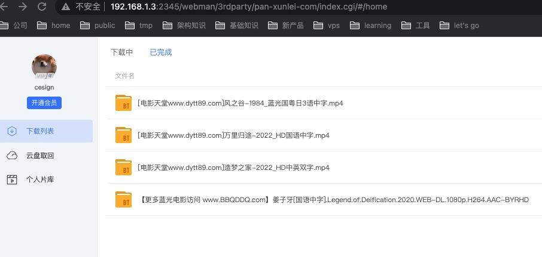

# 迅雷下载器安装和配置

迅雷作为国内最大的下载工具，其下载速度和稳定性都是非常不错的。在Linux上现已支持Docker版本，可以方便的在Linux上安装和使用。感谢 [cnk3x](https://github.com/cnk3x/xunlei) 的移植，让我们得以使用。

## 效果演示


## 安装
### 1.安装迅雷
运行如下命令即可：
```sh
git clone https://github.com/jwcesign/kubespider.git
cd kubespider
bash hack/install_thunder.sh
```

### 2.确认安装
运行如下命令，确认迅雷已经安装成功：
```sh
docker ps | grep xunlei
```
输出类似：
```sh
5eafffa17ac8   cnk3x/xunlei:latest            "/xunlei/xlp syno"       5 days ago       Up 5 days
```

## 配置
打开地址`http://<server_ip>:2345`，初次使用会询问内测邀请码，请在github上提issue，我会尽快回复。
