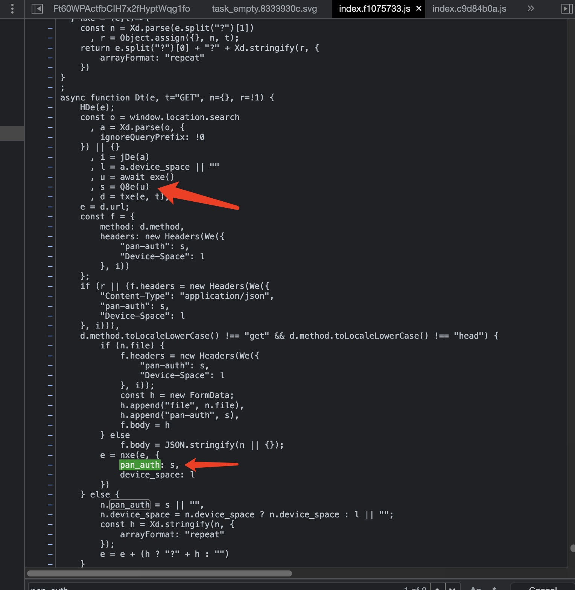
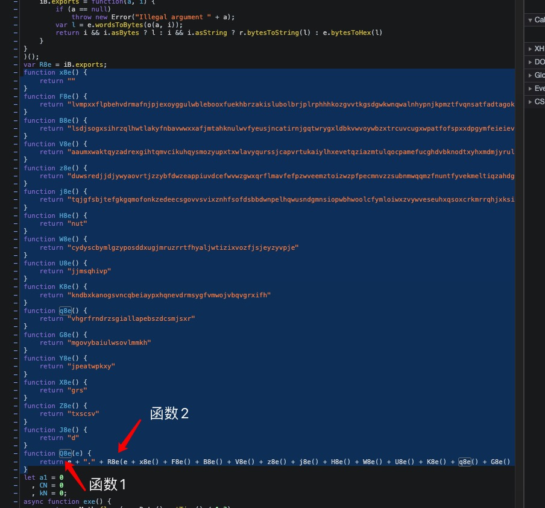

# 迅雷下载提供器安装和配置
## 简介
迅雷作为国内最大的下载工具，其下载速度和稳定性都是非常不错的。在Linux上现已支持Docker版本，可以方便的在Linux上安装和使用。感谢 [cnk3x](https://github.com/cnk3x/xunlei) 的移植，让我们得以使用。

## 最终效果
效果如图，结合迅雷，Kubespider会调用迅雷，下载所有剧集并追更：


## 安装
### 1.安装迅雷
运行如下命令即可：
```sh
git clone https://github.com/opennaslab/kubespider.git
cd kubespider
bash hack/install_thunder.sh
```

当然也可以自己安装迅雷（参照[迅雷](https://github.com/cnk3x/xunlei)的文档）。但是确保不要打开迅雷面板的认证（即设置环境变量 `XL_BA_USER` 和 `XL_BA_PASSWORD`），不然Kubespider无法调用迅雷。

### 2.确认安装
运行如下命令，确认迅雷已经安装成功：
```sh
docker ps | grep xunlei
```
输出类似：
```sh
5eafffa17ac8   cnk3x/xunlei:latest            "/xunlei/xlp syno"       5 days ago       Up 5 days
```

## 配置
### 1.通用配置
打开地址`http://<server_ip>:2345`，初次使用会询问内测邀请码，输入 `我不是矿神IMNKS`，如果无效，请在github上提issue，我会尽快回复。

### 2.Kubespider对接配置（可选）
由于迅雷的设计问题，此部分配置会比较复杂，做好心理准备，如果遇到任何问题，都可以issue提问，我会尽快回复。

#### 1.获取JS脚本名
curl迅雷web ui地址：
```sh
curl http://<server_ip>:2345/webman/3rdparty/pan-xunlei-com/index.cgi/\#/home
```
最后会输出如下内容，看如下script的引用文件为`index.f1075733.js`：
```html
<!DOCTYPE html>
<html lang="en">
  <head>
    <meta charset="UTF-8" />
    <meta name="renderer" content="webkit" />
    <meta name="force-rendering" content="webkit" />
    <meta http-equiv="X-UA-Compatible" content="IE=Edge,chrome=1" />
    <link rel="icon" type="image/x-icon" href="//pan.xunlei.com/icon.png" />
    <meta name="viewport" content="width=device-width, initial-scale=1.0" />
    <script>
      this.globalThis || (this.globalThis = this);
    </script>
    <title>迅雷下载</title>
    <script type="module" crossorigin src="assets/index.f1075733.js"></script>
    ...省略...
```

#### 2.获取JS脚本
游览器访问`http://<server_ip>:2345`，F12找到步骤1的文件，按如下步骤获取格式化代码：


#### 3.获取关键加密代码
`Ctrl+F` 搜索 `pan_auth`字段，找到给`pan_auth`赋值的变量以及函数（如这里的s和Q8e）：


然后搜索函数（如这里的Q8e），相关加密代码段（如下连续代码），并记住`函数1`和`函数2`名字:


#### 4.设置get_token.js
现在打开`${home}/kubespider/.config/dependencies/xunlei_download_provider/get_token.js`:
  

将函数1的名字替换为步骤3的函数1名字，函数2名字替换为函数2名字，代码段替换为步骤2的代码段。

#### 5.获取device_id并设置
游览器访问`http://<server_ip>:2345`，F12后点击Netowk，找到如下获取device_id并设置:

如上，device_id为`5c78ea560a34ed4b4fbe6686da1172b4`。

#### 6.设置download_provider文件
配置文件如下：
```yaml
xunlei:
  type: xunlei_download_provider
  enable: false
  token_js_path: "/root/.config/dependencies/xunlei_download_provider/get_token.js"
  http_endpoint: http://127.0.0.1:2345
  device_id: 5c78ea560a34ed4b4fbe6686da1172b4
  priority: 3

```
其中：

* 名称，可自定义（不可重复），可以在 `source_provider.yaml` 中按名称指定下载器。
* `type`: 表示此下载器的类型，需为 `xunlei_download_provider`。
* `enable`: 设置是否使用此provider，只能使用一个，后续开发优先级后可以多个一起使用。
* `token_js_path`: 不用修改，如果你知道如何开发，可以修改。
* `http_endpoint`: 服务地址。
* `device_id`: 步骤5获取到的device_id。
* `priority`: 下载提供器优先级，数字越小，优先级越高，下载资源时按优先级尝试，无法下载或下载失败时切换下载器。

#### 7.测试下载
配置好后，运行如下命令：
```
docker restart kubespider
```
按最终效果图测试一下即可。

#### 8.自动获取
[#505](https://github.com/opennaslab/kubespider/pull/505) `3.21.0` 之后迅雷版本会自动获取 `device_id` `token`
