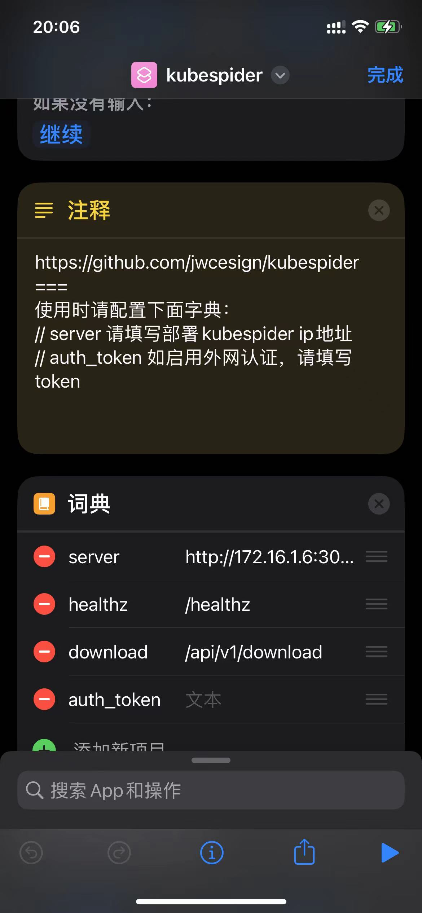

# tiktok-dlp(抖音)下载提供器安装和配置

## 简介

[imgyh/tiktok](https://github.com/imgyh/tiktok) 是一个开源项目，用以下载去水印的抖音视频。

## 最终效果

效果如图，Kubespider通过对接此下载器，可以下载抖音视频。


## 安装

### 1.安装抖音下载器

运行如下命令即可：

```sh
git clone https://github.com/opennaslab/kubespider.git
cd kubespider
bash hack/install_tiktokdlp.sh
```

### 2.确认安装

运行如下命令，确认下载器已经安装成功：

```sh
docker ps | grep tiktok_dlp
```

输出类似：

```sh
CONTAINER ID    IMAGE                              COMMAND             CREATED          STATUS    PORTS                     NAMES
bb0151d71ea3    smilekung/tiktok-dlp:latest        "python3 app.py"    8 minutes ago    Up        0.0.0.0:9005->3081/tcp    tiktok-dlp
```

## 配置

### 1.通用配置

为了支持更稳定的下载，如遇到不能下载的情况，需要设置cookie。可以按照以下步骤获取cookie：

1.打开chrome的隐身模式并登录抖音账号，[https://www.douyin.com/](https://www.douyin.com/)。


2.F12选择Application，查看cookie信息  


找到以下Name的cookie，复制Value的内容。
`msToken`、`ttwid`、`odin_tt`、`passport_csrf_token`、`sid_guard`

3.将cookie按照以下格式进行拼接

```txt
msToken=xxx;ttwid=xxx;odin_tt=xxx;passport_csrf_token=xxx;sid_guard=xxx;
```

其中，`xxx`为步骤2得到的具体cookie value。

### 2.Kubespider对接配置（可选）

#### 1.设置download_provider文件

配置文件如下：

```yaml
tiktok-dlp:
  type: tiktok_download_provider
  enable: false
  priority: 6
  http_endpoint_host: http://127.0.0.1
  http_endpoint_port: 3083
  cookie:
```

其中：

* 名称，可自定义（不可重复），可以在 `source_provider.yaml` 中按名称指定下载器。
* `type`: 表示此下载器的类型，需为 `tiktok_download_provider`。
* `enable`: 设置是否使用此provider。
* `http_endpoint_host`: tiktok-dlp下载软件IP地址。
* `http_endpoint`: tiktok-dlp下载软件IP端口。
* `priority`: 下载提供器优先级，数字越小，优先级越高，下载资源时按优先级尝试，无法下载或下载失败时切换下载器。
* `cookie`: 抖音cookie，可选配置，配置方式请参考上文。

#### 2.测试下载

配置好后，运行如下命令：

```
docker restart kubespider
```

按最终效果图测试一下即可。

## 友情提示

使用iOS的用户，可以使用快捷指令，参考：[kubespider](https://www.icloud.com/shortcuts/c773b469c21640908e33eda8617b5f63)

添加后，直接分享到快捷指令，即可下载。

### 最终效果


详细步骤如下：

### 1. 设置kubespider服务地址和端口

需要修改词典中`server`，填写对应的kubespider服务地址和端口。


### 2. 检查是否配置成功

点击快捷指令，弹窗提示配置成功即可。


### 3. 分享到快捷指令

在需要下载的视频时，点击分享，选择更多分享，选择kubespider即可。


