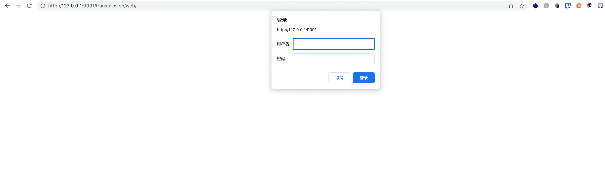

# Transmission下载提供器安装和配置
## 简介
Transmission 是 Linux 下的一款 BitTorrent 下载软件。 比其他客户端使用更少的资源, 比较适合保种使用。
## 最终效果


## 安装
### 1. 安装Transmission
运行如下命令即可
```sh
git clone https://github.com/jwcesign/kubespider.git
cd kubespider
bash hack/install_transmission.sh
```

### 2. 确认安装
运行如下命令，确认Transmission已经安装成功：
```sh
docker ps | grep transmission
```
输出类似：
```sh
CONTAINER ID   IMAGE                             COMMAND   CREATED         STATUS       PORTS                    NAMES
40f91a1532e6   linuxserver/transmission:latest   "/init"   2 seconds ago   Up 1 second  0.0.0.0:9091->9091/tcp   transmission
```

打开浏览器进入如下网址检查是否成功启动
```sh
http://<your-nas-ip>:9091
```
如果正常启动，则可以看到输入账号密码的界面，初始账号密码为
```
username = admin
password = admin
```

登录之后则可以进入上述最终效果中的使用界面
## 配置
### 1.Transmission 配置
默认配置足以运行，但是如果有特殊需求如更改用户名或密码，则可以进入`hack/install_transmission.sh` 启动脚本中进行配置
```bash
# 5.Install transmission
docker run -d \
  --name=transmission \
  -e PUID=1000 \
  -e PGID=1000 \
  -e TZ=Asia/Shanghai \
  -e USER=admin \
  -e PASS=admin \
  -p 9091:9091 \
  -p 51413:51413 \
  -p 51413:51413/udp \
  -v ${HOME}/kubespider/transmission/:/config \
  -v ${HOME}/kubespider/nas/:/downloads \
  --restart unless-stopped \
  linuxserver/transmission:latest
```
**需要注意，如果更改了相关配置，在 Kubespider 对接配置中进行对应的修改**

### 2.Kubespider 对接配置

如果你进行了修改配置，请务必修改 Kubespider 的对接配置，如果没有修改则可以直接使用默认配置使用

Transmission 对应的配置文件如下

```yaml
transmission:
  type: transmission_download_provider
  enable: false,
  download_base_path: "/downloads/"
  http_endpoint: http://127.0.0.1:9091/transmission/rpc
  username: admin
  password: admin
  priority: 5
```

其中:

* 名称，可自定义（不可重复），可以在 `source_provider.yaml` 中按名称指定下载器。
* `type`: 表示此下载器的类型，需为 `qbittorrent_download_provider`。
* `enable`: 设置是否使用此 provider，只能使用一个，后续开发优先级后可以多个一起使用。
* `http_endpoint`: transmission 服务 rpc 地址。
* `username`: 登录 transmission 的用户名，与 transmission 设置中保持一致。
* `password`: 登录 transmission 的密码，与 transmission 设置中保持一致。
* `priority`: 下载提供器优先级，数字越小，优先级越高，下载资源时按优先级尝试，无法下载或下载失败时切换下载器。

#### 2.1 来自订阅源的配置

Transmission 支持订阅源传递过来的下载参数：

source_provider.yaml:

```yaml
---
mikan_oshi:
  enable: true
  rss_link: https://mikanani.me/RSS/Bangumi?bangumiId=2995&subgroupid=534
  type: mikanani_source_provider
  downloader:
    # 指定使用 transmission 进行下载
    - transmission
```

### 3.测试下载
配置好后，运行如下命令：
```
docker restart kubespider
```
按最终效果图测试一下即可。
