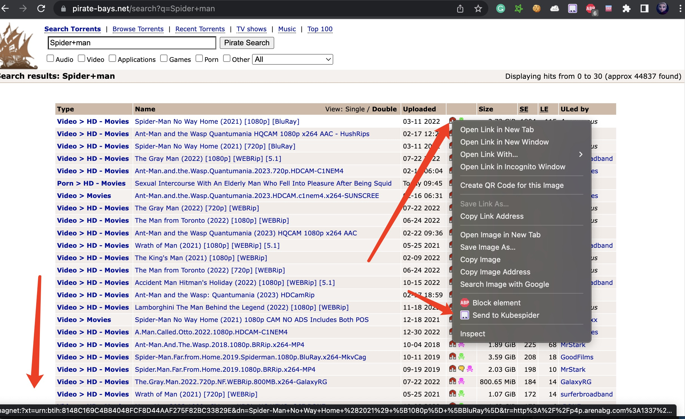
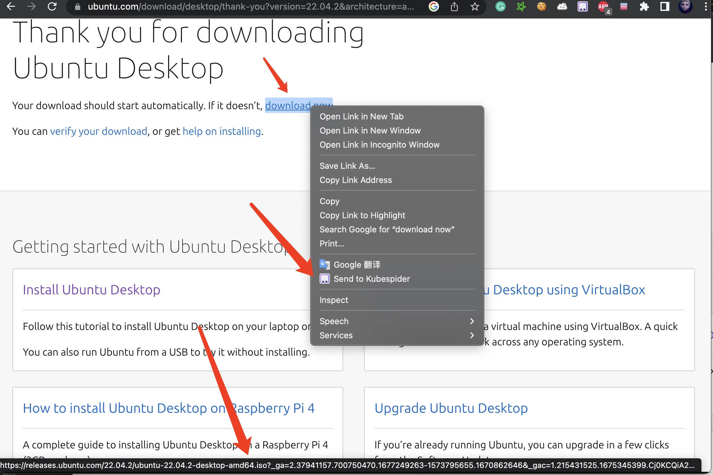

# 触发下载使用
## 简介
为了构建统一的家庭下载中心，Kubespider期望接管所有下载任务，所有资源都能被触发下载，如在Chrome中，右键某资源链接，选择`Send to Kubespider`即可触发下载。

## magnet触发下载
在Chrome游览器中，鼠标移动到magnet链接处，左下角会显示magnet:xxx，此时右键选择`Send to Kubespider`即可触发下载magnet资源：

## torrent触发下载
在Chrome游览器中，鼠标移动到torrent链接处，左下角会显示xxx.torrent，此时右键选择`Send to Kubespider`即可触发下载torrent资源：

## 通用文件触发下载
在Chrome游览器中，鼠标移动到链接处，左下角会显示相关资源链接，此时右键选择`Send to Kubespider`即可触发下载通用资源：

