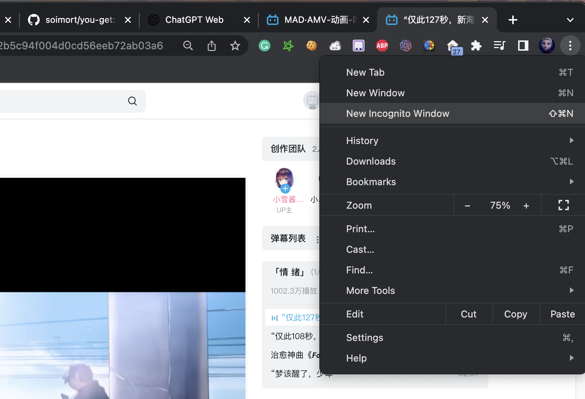

# You-Get下载提供器安装和配置
## 简介
[You-Get](https://github.com/soimort/you-get) 是一个开源的命令行工具，用于从互联网上下载视频、音频和其他类型的媒体资源。它支持多种视频和音频网站，包括YouTube、Vimeo、Twitch、SoundCloud等。用户可以通过简单的命令行输入来下载他们想要的各种媒体文件。You-Get还支持多线程下载，因此可以更快地下载大型文件。

## 最终效果
效果如图，结合You-Gey，Kubespider会调用You-Get，下载Bilibili视频：


## 安装
### 1.安装You-Get下载器
运行如下命令即可：
```sh
git clone https://github.com/opennaslab/kubespider.git
cd kubespider
bash hack/install_youget.sh
```

### 2.确认安装
运行如下命令，确认迅雷已经安装成功：
```sh
docker ps | grep youget
```
输出类似：
```sh
8314038add1b   cesign/youget-downloader:latest    "python3 /root/app/a…"   2 days ago     Up 2 days  youget
```

## 配置
### 1.通用配置
为了下载高清视频，有时候需要设置认证cookie，各资源网站的cookie设置如下：

#### Bilibili下载设置
1.打开chrome的隐身模式  


2.登陆bilibili  


3.F12选择network，查看cookie信息  
  
找到关键信息并复制：`SESSDATA=xxx; bili_jct=xxx;`
找到并复制后关闭窗口。

4.在chrome市场安装插件`Get cookies.txt LOCALLY`  
  
下载地址：[link](https://chrome.google.com/webstore/detail/get-cookiestxt-locally/cclelndahbckbenkjhflpdbgdldlbecc?hl=en)  

5.复制bilibili完整cookie(非隐身模式)  


6.将复制内容拷贝到`${HOME}/kubespider/youget/bilibili_cookie.txt`  
```txt
# Netscape HTTP Cookie File
# http://curl.haxx.se/rfc/cookie_spec.html
# This is a generated file!  Do not edit.

.bilibili.com	TRUE	/	TRUE	1695964694	SESSDATA	xxx
.bilibili.com	TRUE	/	FALSE	1695964694	bili_jct	xxx
```
其中，`xxx`为步骤3的到的内容。

### 2.Kubespider对接配置（可选）
#### 1.设置download_provider文件

配置文件如下：

```yaml
youget:
  type: youget_download_provider
  enable: false
  http_endpoint_host: http://127.0.0.1
  http_endpoint_port: '3081'
  priority: 0
```

其中：

* 名称，可自定义（不可重复），可以在 `source_provider.yaml` 中按名称指定下载器。
* `type`: 表示此下载器的类型，需为 `youget_download_provider`。
* `enable`: 设置是否使用此provider。
* `http_endpoint_host`: you-get下载软件IP地址。
* `http_endpoint`: you-get下载软件IP端口。
* `priority`: 下载提供器优先级，数字越小，优先级越高，下载资源时按优先级尝试，无法下载或下载失败时切换下载器。

#### 2.测试下载
配置好后，运行如下命令：
```
docker restart kubespider
```
按最终效果图测试一下即可。