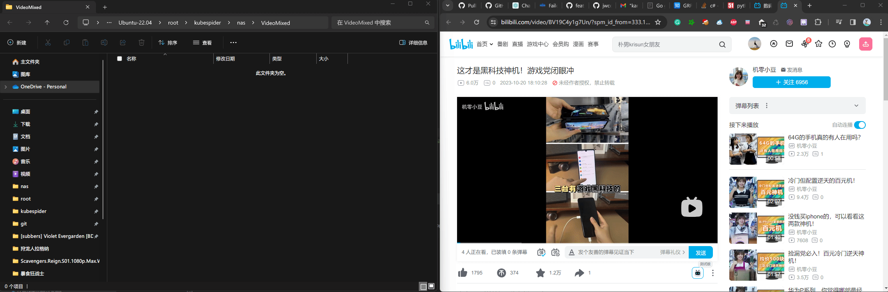
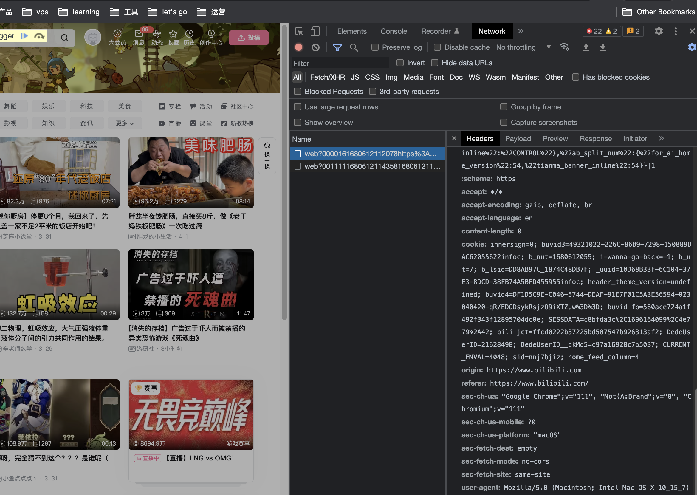

# yutto 下载提供器安装和配置
## 简介
[yutto](https://github.com/yutto-dev/yutto) 是一个开源的命令行工具，一个可爱且任性的 B 站视频下载器（bilili V2）。

## 最终效果
效果如图，结合 yutto，Kubespider会调用 yutto，下载Bilibili视频：



## 安装
### 1.获取bilibili配置
为了下载高清视频，有时候需要设置认证cookie：

#### 1.获取cookie
1.打开chrome的隐身模式


2.登陆bilibili


3.F12选择network，查看cookie信息



找到关键信息并复制：`SESSDATA=xxx; bili_jct=xxx;`
这里复制SESSDATA后，bilibili_jct之前的的类容，如复制：`b8fab4a9%2C1718252...FRIIE`

### 2.安装yutto
运行如下命令即可：
```sh
git clone https://github.com/opennaslab/kubespider.git
cd kubespider
# 前面获取到的cookie值
export BILIBILI_SESSDATA=b8fab4a9%2C1718252...FRIIE
bash hack/install_yutto.sh
```

### 3.确认安装
运行如下命令，确认yutto已经安装成功：
```sh
docker ps | grep yutto
```

## Kubespider对接配置（可选）
### 1.设置download_provider文件

配置文件如下：

```yaml
yutto:
  type: yutto_download_provider
  enable: false
  http_endpoint_host: http://127.0.0.1
  http_endpoint_port: 3084
  priority: 1
```

其中：

* 名称，可自定义（不可重复），可以在 `source_provider.yaml` 中按名称指定下载器。
* `type`: 表示此下载器的类型，需为 `yutto_download_provider`。
* `enable`: 设置是否使用此provider。
* `http_endpoint_host`: yutto下载软件IP地址。
* `http_endpoint`: yutto下载软件IP端口。
* `priority`: 下载提供器优先级，数字越小，优先级越高，下载资源时按优先级尝试，无法下载或下载失败时切换下载器。

### 2.测试下载
配置好后，运行如下命令：
```
docker restart kubespider
```
按最终效果图测试一下即可。